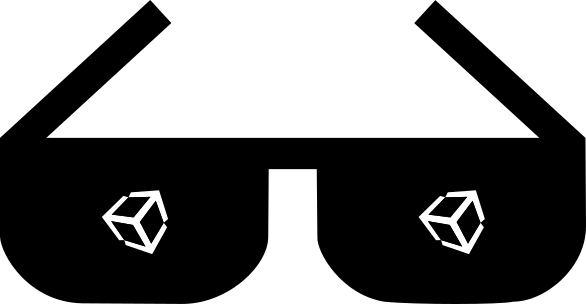

	

		
	

   
	

		<h1>Awesome Unity</h1>		
							
		

			A categorized community-driven collection of high-quality awesome Unity assets, projects, and resources. 
			 
			Free assets and resources are prioritized over paid when possible.
			  
			Suggestions and contributions are always welcome!
			 			
			Make sure to read the <a href="https://github.com/agarcialeon/awesome-unity/blob/master/CONTRIBUTING.md"> contribution guidelines </a> for more information before submitting a pull request.

		

	

# :bookmark_tabs: Contents

- [Motivation](#motivation)
- [Considerations](#considerations)
- [Legend](#legend)
	- [Icons](#icons)
	- [Tags](#tags)
- [Categories](#categories)
  - [2D](#2d)
  - [AI](#ai)
  - [Machine Learning](#machine-learning)
  - [Audio](#audio)
  - [Animation](#animation)
  - [Tweening](#tweening)
  - [Augmented Reality](#augmented-reality)
  - [Virtual Reality](#virtual-reality)
  - [Mixed Reality](#mixed-reality)
  - [Computer Vision & Tracking](#computer-vision-and-tracking)
  - [Speech Recognition](#speech-recognition)
  - [Camera](#camera)
  - [Physics](#physics)
  - [Character Controllers](#character-controllers)
  	- [2D Character Controllers](#2d-character-controllers)
  	- [3D Character Controllers](#3d-character-controllers)
  - [Frameworks](#frameworks)
  - [Input](#input)
  	- [Controller Mappings](#controller-mappings)
  - [Modeling](#modeling)
  - [Monetization](#monetization)
  - [Services](#services)
  - [Localization (L18n)](#localization)
  - [Networking](#networking)
  - [Scripting](#scripting)
  	- [Algorithms](#algorithms)
	- [Patterns](#patterns)
	- [Pooling Systems](#pooling)
	- [Libraries](#libraries)
  	- [Utilities](#utilities)
  	- [Tools](#tools)
	- [Plugins](#plugins) 
   	- [Visual Scripting](#visual-scripting)
   	- [Snippets & Gists](#snippets-&-gists)
	- [Integrated Development Environment (IDE)](#ide)
  - [Serialization](#serialization)
  - [Effects & Shaders](#effects-shaders)
  	- [Shaders](#shaders)
  	- [Skyboxes](#skyboxes)
  	- [Effects](#effects)
  	- [Particle Systems](#particle-systems)
  	- [Lightning / Points of Clouds](#lightning-points-clouds)
  - [UI](#ui)
  - [Procedural Generation](#procedural-generation)
  - [Terrain](#terrain) 
  - [Textures](#textures)
  - [Importers & Exporters](#importers-exporters)
  - [Databases](#databases)
  - [VCS (Version Control Systems)](#vcs)
  - [Continuous Integration (CI)](#continuous-integration)
  - [Testing](#testing)
  - [Customization](#customization)
  - [Extensibility](#extensibility)
  - [Modding](#modding)
  - [Miscellaneuous](#miscellaneous)  
- [Learning Resources](#learning-resources)
  - [Tips and Tricks](#tips-tricks)
  - [Books](#books)
  - [Blogs](#blogs)
  - [Videos](#videos)
  	- [Youtube Channels](#youtube-channels)
   	- [Unity Official Sessions](#unity-official-sessions)
  - [Tutorials](#tutorials)
  - [Best Practices](#best-practices)
  - [Shortcuts](#shortcuts)  
  - [Other References](#other-references)
- [Recommended Asset Store Packages](#recommended-packages) 
- [Projects](#projects)
  - [Games](#games)
- [Communities](#communities)
  - [Chat Servers](#chat-servers)
  - [Forums](#forums)
  - [Groups](#groups)
  - [People to Follow](#people-to-follow)
  	- [Unity Developers](#follow-unity-developers)
  	- [Independent Developers](#follow-independent-developers)
- [Frequently Asked Questions (FAQ)](#faq)
- [Contributors to this repository](#contributors)
- [Contributing](#contributing)
- [Code of Conduct](#code-of-conduct)
- [To be done](#to-do)

# Motivation 

:construction:

<!-- I started this project because I felt that starting learning Unity was at first like learning any other language. First you learn the syntax and start creating basic apps but then you get better at developing when you learn the tools for that language and how to improve your work with them. I think this is the same, because when I learned Unity for the first time you needed to code a lot of basic tools that could greatly improve the time you spend making your game or app instead of reinventing the wheel. -->

# Considerations 

There is always a posibility that this repository becomes outdated, mostly because new packages from the asset store and repositories appear in the future. This is because of the nature of technlogy and this can be avoided, so in order to keep this project as updated as possible with what other users know, please create a new issue to include or remove what you think is necessary.

Another point is the categorization of the resources provided here. Since some of them can be included in different categories at the same time a cross reference will be created in the form of a hastag to notify you (the visitor) that maybe you need to look in a different place of this repository or in other external site to find more info.

Finally, you need to know that this is not the only repository on Github that gathers Unity related repositories. This is just another try to get the best of all the existing content out there for Unity developers. So please, be grateful with all the other developers that put effort collection their respective lists of resources by visiting their repositories (they will be listed below).

I hope all of you find this helpful. Let's go with the contents.

# Legend 

## Icons 

Free resource: :free:

Paid resource: :moneybag:

Interesting resource: :cool: 

<!-- 
:new:
-->

## Tags 

(UNMAINTAINED) - The repository hasn't been updated for a long time.

(DEPRECATED) - Another solution or package has been released that does the same and it's more recent.

(ARCHIVED) - The repository is read only for learning purposes.

#[CATEGORY] - Where [CATEGORY] represents a category of the document. Means that the resource is related with another category too.

# :bookmark: Categories 

## :space_invader: 2D 

* [2D Rope System](https://www.assetstore.unity3d.com/en/#!/content/17722) - Scripts for creating any type of 2D ropes in the editor or during runtime. :moneybag:
* [2D Toolkit](https://www.assetstore.unity3d.com/en/#!/content/908) - An efficient & flexible 2D sprite, collider set-up, text, tilemap and UI system. :moneybag:
* [Ferr2D Terrain Tool](https://www.assetstore.unity3d.com/en/#!/content/11653) - Quickly create handcrafted 2D landscapes and levels. :moneybag:
* [Pixel Camera 2D](https://github.com/RyanNielson/PixelCamera2D) - A simple pixel perfect camera with scaling options for 2D Games.
* [Spine](http://esotericsoftware.com) - A skeletal animation editor with a Unity library. :moneybag:
* [Tiled2Unity](https://github.com/Seanba/Tiled2Unity) - Export [Tiled](http://www.mapeditor.org) Map Editor (TMX) files into Unity.
* [unity2d-tmx](https://github.com/suppayami/unity2d-tmx) - A small library to import and render tilemap in Unity2D, only support TMX file format.
* [Unity Anima2D](https://www.assetstore.unity3d.com/en/#!/content/79840) - Advanced skeletal animation editor with support for both per-object and skinned mesh animation with an integrated in-editor skinning tool.
* [UnityTiled](https://github.com/nickgravelyn/UnityTiled) - An importer for [Tiled](http://www.mapeditor.org) maps.
* [2d-techdemos](https://github.com/Unity-Technologies/2d-techdemos) - Tech Demos for Unity 2D Features.
* [SpriteDicing](https://github.com/Elringus/SpriteDicing) - Unity extension for reusing sprite texture areas.
* [PixelSpriteGenerator-Unity](https://github.com/Shogan/PixelSpriteGenerator-Unity) - A port of the PixelSpriteGenerator to C# for use with the Unity3D game engine.
* [unity-ecs-instanced-sprite-renderer](https://github.com/paullj/unity-ecs-instanced-sprite-renderer) - An example of a simple performant sprite renderer using Unity's new ECS system.
* [FogSprites](https://github.com/bricevdm/FogSprites) - Modification of Unity's sprite shaders supporting Fog.
* [HermodToolkit](https://github.com/Sirithang/HermodToolkit) - A set of 2D tools for Unity.(#2D)
* [Unity2D-Components](https://github.com/cmilr/Unity2D-Components) - A constantly evolving array of Unity C# components for 2D games, including classes for pixel art cameras, events & messaging, saving & loading game data, collision handlers, object pools, and more.
* [2DTileMapLevelEditor](https://github.com/GracesGames/2DTileMapLevelEditor) - 2D Tile Map Level Editor for Unity.
* [DataRenderer2D](https://github.com/geniikw/DataRenderer2D) - Make mesh like line, polygon, etc in Unity3D.
* [Vector Graphics Samples](https://github.com/Unity-Technologies/vector-graphics-samples) - SVG and Vector Graphics Sample Project.

## :bulb: AI 

* [Pathfinding](https://github.com/antonpantev/pathfinding "") - Find paths in Unity Tilemaps with A* Search.
* [Unity Movement AI](https://github.com/antonpantev/unity-movement-ai "") - A Unity library for common movement AI.
* [A* Pathfinding Project](http://arongranberg.com/astar/) - Lightning fast pathfinding with heavily optimized algorithms and a large feature set.
* [Apex Path](https://www.assetstore.unity3d.com/en/#!/content/17943) - Apex Path handles dynamic pathfinding including local avoidance steering and dynamic obstacles. :moneybag:
* [Crystal AI](https://github.com/igiagkiozis/CrystalAI) - Crystal is a fast, scalable and extensible utility based AI framework for C# and Unity.
* [Behaviac](https://github.com/Tencent/behaviac) - Is a framework of the game AI development, and it also can be used as a rapid game prototype design tool. behaviac supports the behavior tree, finite state machine and hierarchical task network(BT, FSM, HTN).
* [TsiU AIToolkit CSharp](https://github.com/FinneyTang/TsiU_AIToolkit_CSharp) - AI Toolkit for Unity.
* [EpPathFinding.cs](https://github.com/juhgiyo/EpPathFinding.cs) - A jump point search algorithm for grid based games in C#.
* [EpPathFinding3D.cs](https://github.com/juhgiyo/EpPathFinding3D.cs) - A 3D jump point search algorithm for cube based games in C#.
* [GOAP](https://github.com/sploreg/goap) - Goal Oriented Action Planning AI in Unity.
* [Unity Movement AI](https://github.com/antonpantev/unity-movement-ai) - A library of common movement AI scripts known as Steering Behaviors. You can use these scripts to help your NPCs move around your game.
* [A Star Pathfinding for Unity](https://github.com/sharpaccent/Astar-for-Unity) - A Star Pathfinder, 3 axis, multithreaded for Unity
* [Openpath](https://github.com/mrzapp/openpath) - Open source pathfinding for Unity.
* [unity-path-finding](https://github.com/mattatz/unity-path-finding) - Shortest path finding with Dijkstra's algorithm for Unity.
* [NPBehave](https://github.com/meniku/NPBehave) - Event Driven Behavior Trees for Unity 3D.
* [fluid-behavior-tree](https://github.com/ashblue/fluid-behavior-tree) - A pure code behavior tree micro-framework built for Unity3D projects. Granting developers the power to dictate their GUI presentation.
* [Unity3d-Finite-State-Machine](https://github.com/thefuntastic/Unity3d-Finite-State-Machine)
* [A* Pathfinding Project Pro](https://arongranberg.com/astar/front) - Lightning fast pathfinding for Unity3D. :moneybag:
* [Unity Neural Network](https://github.com/Blueteak/Unity-Neural-Network) - Simple neural network implemented in C# for Unity3D.

## :computer: Machine Learning 

* [Unity3D Machine Learning Toolkit](https://github.com/Unity-Technologies/ml-agents "") - Unity Machine Learning Agents Toolkit.
* [PPOL](https://github.com/A7ocin/PPOL) - A crowd simulator based on Unity's ML Agents and using PPO Reinforcement Learning Algorithm.
* [UnityTensorflowKeras](https://github.com/tcmxx/UnityTensorflowKeras "") - Unity In Editor Deep Learning Tools. Using KerasSharp, TensorflowSharp, Unity MLAgent. In-Editor training and no python needed.
* [Unity Reinforcement Learning](https://github.com/eProw/Unity-reinforcement-learning "") - Reinforcement Learning project based on genetic algorithms.

## :musical_score: Audio 

* [Reaktion](https://github.com/keijiro/Reaktion "Audio reactive animation toolkit for Unity.")
* [Unity-NodeSynthesizer](https://github.com/rngtm/Unity-NodeSynthesizer "") - Nose-Based Synthesizer on UnityEditor.
* [Unity-Synth-Experiments](https://github.com/pixlpa/Unity-Synth-Experiments "") - A set of simple generative synth scripts for Unity written in C# (OnAudioFilterRead).
* [Videolab](https://github.com/teenageengineering/videolab "") - Toolkit for designing midi-controlled video content.
* [Resonance-audio-unity-sdk](https://github.com/resonance-audio/resonance-audio-unity-sdk "") - Resonance Audio SDK for Unity.
* [MusicEngine](https://github.com/geekdrums/MusicEngine "") - Make music synced game with Unity.
* [UnityWav](https://github.com/deadlyfingers/UnityWav "") - WAV utility for saving and loading wav files in Unity.
* [UnityOSC](https://github.com/thomasfredericks/UnityOSC "") - Open Sound Control (OSC) for Unity.
* [Rhythmify](https://github.com/Gkxd/Rhythmify "") - A Rhythm Syncing Implementation for Unity.
* [Algorithmic-beat-mapping-unity](https://github.com/jesse-scam/algorithmic-beat-mapping-unity "") - Real-time and Preprocessed Audio Analysis for Onset Detection (Beat Mapping) Using Spectral Flux.
* [UniBpmAnalyzer](https://github.com/WestHillApps/UniBpmAnalyzer "") - BPM analyzer for Unity.
* [Spotify4Unity](https://github.com/JoshLmao/Spotify4Unity "") - Set of UI tools and scripts for integrating Spotify into your Unity game/app!
* [CSharpSynthForUnity](https://github.com/kewlniss/CSharpSynthForUnity "") - Ported CSharpSynth Project from [codeplex](http://csharpsynthproject.codeplex.com/) to work in Unity.
* [UniMic](https://github.com/adrenak/UniMic "") - A wrapper for Unity's Microphone class.
* [Low-latency_Sound_for_UnityAndroid](https://github.com/tsubaki/Low-latency_Sound_for_UnityAndroid "")
* [USFXR](https://github.com/zeh/usfxr) - A C# library used to generate and play game-like procedural audio effects inside Unity.
* [Audio Toolkit](https://assetstore.unity.com/packages/tools/audio/audio-toolkit-free-version-2679) - A complete, easy-to-use, and performance optimized framework to play and manage music and sound effects in Unity. Both :moneybag: and :free:
* [Unity Beat Detection](https://github.com/allanpichardo/Unity-Beat-Detection) - Musical beat detection and audio spectrum analysis for use with the Unity game engine.
* [LibPdIntegration](https://github.com/LibPdIntegration/LibPdIntegration) - A libpd wrapper for Unity. See [Pure Data](https://puredata.info/)

## :runner: Animation 

* [SpriteAnimation](https://github.com/FarrokhGames/SpriteAnimation "") - A Unity-based sprite animator for simple and advanced animation setups.
* [AI4Animation](https://github.com/sebastianstarke/AI4Animation "") - Character Animation in Unity 3D using Deep Learning and Artificial Intelligence.
* [Boner2D](https://github.com/playemgames/Boner2D "") - Free Open Source 2D Animation Tools for Unity.
* [PuppetTest](https://github.com/keijiro/PuppetTest "") - An experiment in procedural dance animation.
* [EasyMotionRecorder](https://github.com/duo-inc/EasyMotionRecorder "") 
* [DragonBonesCSharp](https://github.com/DragonBones/DragonBonesCSharp "") - DragonBones C# Runtime.
* [Unity-Runtime-Animation-Recorder](https://github.com/newyellow/Unity-Runtime-Animation-Recorder "") - Record animations in Unity runtime. Can save to .anim, maya, or FBX ASCII format.
* [UnityChanSpringBone](https://github.com/unity3d-jp/UnityChanSpringBone "") - UnityChan Sping Bone System for lightweight secondary animations.
* [LeanTween](https://github.com/dentedpixel/LeanTween "") - An efficient animation engine for Unity. [Asset Store Link](https://www.assetstore.unity3d.com/en/#!/content/3595).
* [UnitySpritesAndBones](https://github.com/Banbury/UnitySpritesAndBones "") - Unity 3D addon for skeletal sprite animations.
* [AnimeRx](https://github.com/kyubuns/AnimeRx "") - Rx Tween Animation Library for Unity.
* [unity-animator-helpers](https://github.com/ashblue/unity-animator-helpers "") - A micro-framework for changing Unity 3D's Animator parameters with ScriptableObject(s). Designed to make going from custom scripts to Animator parameters easy. Works with 2D or 3D projects.
* [unity-animator-helpers](https://github.com/Elendow/SpritedowAnimator "") - A plugin to do simple sprite animations avoiding the big and tedious Unity's Mechanim system. (#2D)
* [UnityGpuInstancedAnimation](https://github.com/piti6/UnityGpuInstancedAnimation "") - Unity animation object with gpu instancing.

## :dancers: Tweening 

* [DOTween](https://www.assetstore.unity3d.com/en/#!/content/27676) - Tween any numeric property or field (including Vectors, Rectangles, etc.), plus some non-numeric ones (like strings). This is the follow-up to HOTween. Github link [here](https://github.com/Demigiant/dotween).
* [GoKit](https://github.com/prime31/GoKit) - An open source, lightweight tween library aimed at making tweening objects dead simple.
* [iTween](https://www.assetstore.unity3d.com/en/#!/content/84) - A simple, and easy to use animation system.
* [XTween](https://github.com/Toki-Labs/XTween "Tweener for Unity")
* [ReMotion](https://github.com/neuecc/ReMotion "Hyper Fast Reactive Tween Engine for Unity") - Hyper Fast Reactive Tween Engine for Unity.
* [ECS-Tween](https://github.com/Xerios/ECS-Tween) - Simple Unity tweening system using ECS that works with GameObjects!

## Augmented Reality 

* [Vuforia](https://vuforia.com/) - Augmented Reality SDK with image and object recognition, smart terrain and extended tracking features.
* [ARToolKit](http://artoolkit.org/documentation/doku.php?id=6_Unity:unity_about) - Augmented Reality SDK that includes libraries, utilities, and examples. (Redirects to DAQRI website.)
* [ARCore Unity SDK](https://github.com/google-ar/arcore-unity-sdk "") - ARCore SDK for Unity.
* [ARFoundation Samples](https://github.com/Unity-Technologies/arfoundation-samples "") - Example content for Unity projects based on [AR Foundation](https://docs.unity3d.com/Packages/com.unity.xr.arfoundation@1.0/manual/index.html).
* [Facial AR Remote](https://github.com/Unity-Technologies/facial-ar-remote "") - A tool that allows you to capture blendshape animations directly from your iPhone X into Unity 3d by use of an app on your phone.
* [ArucoUnity](https://github.com/NormandErwan/ArucoUnity "") - Bring augmented reality to Unity by tracking Aruco markers in real time.
* [UnityARFaceDeformation](https://github.com/kitasenjudesign/UnityARFaceDeformation "") - AR Face Deformation with Unity ARKit Plugin.
* [Location-Based-Markerless-Augmented-Reality](https://github.com/hynra/Location-Based-Markerless-Augmented-Reality "") - Markerless Augmented Reality based on location made with Unity and Kudan AR SDK.

## Virtual Reality 

* [VRTK (Virtual Reality Toolkit)](https://github.com/thestonefox/VRTK "") - A productive VR Toolkit for rapidly building VR solutions in Unity3d. :cool:
* [VRTK Unity Core](https://github.com/ExtendRealityLtd/VRTK.Unity.Core "") - A set of design patterns for rapidly building VR solutions in Unity3d.
* [SteamVR Unity Toolkit](https://www.assetstore.unity3d.com/en/#!/content/64131) - Scripts and Great examples to abstract the use of VR controller actions in Unity.
* [Google VR SDK](https://github.com/googlevr/gvr-unity-sdk "") - Scripts and prefabs to help with the development of Google Daydream and Cardboard apps for Android and iOS. (https://developers.google.com/vr/unity)
* [NewtonVR](https://github.com/TomorrowTodayLabs/NewtonVR "") - A virtual reality interaction system for unity based on physics.
* [OVRLay](https://github.com/benotter/OVRLay "") - An easy-to-use toolkit for developing OpenVR Overlays with Unity Engine!
* [MoonMotion](https://github.com/MoonMotionProject/MoonMotion "") - Free and open source toolkit for VR locomotion.
* [VRTeleportationTourTemplate](https://github.com/wotakuro/VRTeleportationTourTemplate "") - Template project for VR tour applications.
* [NatCam VR Cardboard](https://github.com/olokobayusuf/NatCam-VR-Cardboard "") - A Google Cardboard VR project using the rear camera preview. Powered by NatCam 1.2.
* [SteamVR Unity Plugin](https://github.com/ValveSoftware/steamvr_unity_plugin "") - Steam VR plugin for Unity.
* [SteamVR Unity Toolkit](https://github.com/WildStyle69/SteamVR_Unity_Toolkit "") - A collection of useful scripts and prefabs for building SteamVR titles in Unity 5.
* [Daydream Renderer for Unity](https://github.com/googlevr/daydream-renderer-for-unity "") - A set of scripts and shaders designed to allow for high quality real-time rendering on the Daydream platform targeting 60fps.
* [Pumkins Avatar Tools](https://github.com/rurre/PumkinsAvatarTools "") - A tool to speed up setting up VRChat avatars in Unity.
* [Mesh Maker VR](https://github.com/createthis/mesh_maker_vr "") - Mesh Maker VR.
* [The Lab Renderer](https://assetstore.unity.com/packages/tools/the-lab-renderer-63141?aid=1100l35sb&utm_source=aff "") - The Lab Renderer (VR Essentials).
* [CreateThis VR UI](https://github.com/createthis/createthis_vr_ui "") - User Interface system for Mesh Maker VR.
* [YVTuber](https://github.com/youten/YVTuber "") - YVTuber(Yume VTuber System) is Unity project for VTuber(Virtual YouTuber).
* [GearVR-Leap-Unity](https://github.com/levrn/gear-vr-leap-unity "") - Workaround in Unity to use Leap Motion Controller with Gear VR (or any other headset that doesn't support it).
* [TBUTT-VR](https://github.com/turbobutton/tbutt-vr "") - A lightweight multiplatform interface for making VR games in Unity.
* [Oculus Rift DK2 Extend Preview](https://github.com/hammmm/OculusRiftDK2ExtendPreview "") - OculusRift DK2 Unity Editor PreviewScript.
* [VketBoothValidator](https://github.com/Kozu-vr/VketBoothValidator "")
* [SteamVR Enabler](https://github.com/demonixis/SteamVREnabler "") - A tool to enable or disable the SteamVR runtime.
* [VRTK_MouseGrab](https://github.com/ousttrue/VRTK_MouseGrab "") - VRTK SDK sample.
* [VRChat Counter](https://github.com/aytimothy/VRChat_Counter "") - A simple counter in VRChat that is network-friendly.
* [UnityViveTrackerExample](https://github.com/WhiteNoise/UnityViveTrackerExample "") - Example of using the Vive trackers to control a character and record it to a generic animation. (#ANIMATION)

## Mixed Reality 

* [Microsoft Mixed Reality Toolkit](https://github.com/Microsoft/MixedRealityToolkit-Unity "") - Microsoft Mixed Reality Toolkit.
* [Editor XR](https://github.com/Unity-Technologies/EditorXR "") - Author XR in XR.
* [XRTK (Mixed Reality Toolkit)](https://github.com/XRTK/core "") - The Mixed Reality Framework's core interface contracts, services, and utilities.
* [Mixed Reality Design Labs Unity](https://github.com/Microsoft/MixedRealityDesignLabs_Unity "") - Mixed Reality Design Labs share experimental samples, explorations and learning from Windows Mixed Reality Design group.

## Computer Vision & Tracking 

* [Leap Motion](https://www.leapmotion.com/ "") - a computer hardware sensor device that supports hand and finger motions as input, analogous to a mouse, but requires no hand contact or touching.
* [Myo](https://support.getmyo.com/hc/en-us) - A gesture control armband developed by Thalmic Labs. See [link](https://xinreality.com/wiki/Myo).
* [Intel Realsense Hand Toolkit for Unity](https://github.com/ReiiYuki/Intel-Realsense-Hand-Toolkit-Unity "") - Intel Realsense Toolkit for Hand tracking and Gestural Recognition on Unity3D.
* [ZED SKD Unity Plugin](https://github.com/stereolabs/zed-unity "") - ZED SDK Unity plugin.
* [UnityCloudVision](https://github.com/comoc/UnityCloudVision "") - Google Cloud Vision API client for Unity.
* [TensorFlowUnity-ObjectDetection](https://github.com/MatthewHallberg/TensorFlowUnity-ObjectDetection "") - Object detection test project with Tensorflow and Unity.

## :loudspeaker: Speech Recognition 

* [Unity-SpeechWithLUIS](https://github.com/ActiveNick/Unity-SpeechWithLUIS "") - Sample Unity project used to demonstrate the integration of Speech Recognition and Language Understanding using the new Microsoft Speech Service (Preview) and LUIS from Microsoft Cognitive Services.
* [Unity-MS-SpeechSDK](https://github.com/ActiveNick/Unity-MS-SpeechSDK "") - Sample Unity project used to demonstrate Speech Recognition using the new Microsoft Speech Service (Preview) via WebSockets.

## :movie_camera: Camera 

* [Cinemachine](https://github.com/Unity-Technologies/upm-package-cinemachine "") - Smart camera tools for passionate creators.
* [unity-cinemachine](https://github.com/tonygod/unity-cinemachine "") - A few helpful starter Unity Cinemachine scripts.
* [Pixel Perfect Retro Camera](https://github.com/wolv-interactive/Pixel-Perfect-Retro-Camera "") - Pixel perfect retro camera system for Unity.
* [Unity Pixel Camera](https://github.com/ChemiKhazi/UnityPixelCamera) - A resolution independent pixel perfect camera for Unity.
* [DeadSimple Pixel-Perfect Camera](https://github.com/cmilr/DeadSimple-Pixel-Perfect-Camera) - An exceedingly easy-to-use pixel perfect orthographic camera script for 2D scenes in Unity. Punch in a few specs and you've got a working pixel perfect camera. It's that easy.
* [UnityEquiCam](https://github.com/bodhid/UnityEquiCam "") - Realtime 360° ( equirectangular ) panorama Camera for Unity.
* [Game Eye 2D](https://github.com/JasonHein/Game-Eye-2D "") - A component based orthographic camera extension for unity that tracks 2D environments.
* [DeadSimple Pixel Perfect Camera](https://github.com/cmilr/DeadSimple-Pixel-Perfect-Camera "") - An exceedingly easy-to-use pixel perfect orthographic camera script for 2D scenes in Unity.
An exceedingly easy-to-use pixel perfect orthographic camera script for 2D scenes in Unity.
* [UFPS](https://www.assetstore.unity3d.com/en/#!/content/2943) - Provides camera, controllers, and other effects for use in FPS games. :moneybag:
* [Physical Camera](https://github.com/Unity-Technologies/Physical-Camera) - Unity Component that can describes a physical camera's attributes. (#Physics)
* [unity-camera-follow-2d](https://github.com/minhhh/unity-camera-follow-2d) - Script to make 2d camera follow players in an interesting way.
* [Unity-CameraSizeToVelocity2D](https://github.com/tonisuo/Unity-CameraSizeToVelocity2D) - Simple script to change the cameras size depending on the velocity of the target.
* [CameraLib4U](https://github.com/mortennobel/CameraLib4U) - A third person camera system for Unity using Chase Camera.

## Physics 

* [BulletSharpUnity3D](https://github.com/Phong13/BulletSharpUnity3d "") - A fork of the BulletSharp project to make the Bullet Physics Engine usable from C# code in Unity3D.
* [gpu-physics-unity](https://github.com/jknightdoeswork/gpu-physics-unity "") - Through this configuration, no per voxel data is transferred between the GPU and the CPU at runtime.
* [Jello Physics](https://github.com/kwanchangnim/Jello-Physics "") - 2D Soft Body Physics for Unity.
* [ECSPhysics](https://github.com/PhilSA/ECSPhysics "") - A physics engine made with Unity ECS.
* [UnityPhysics2D](https://github.com/MelvynMay/UnityPhysics2D) - Examples of various Unity 2D Physics components and features. 
* [PBD Fluid in Unity](https://github.com/Scrawk/PBD-Fluid-in-Unity) - A PBD fluid in unity running on the GPU. 
* [UnityMathReference](https://github.com/zezba9000/UnityMathReference) - Math reference for games and more. All visualized in Unity3D.
* [Custom 2D Colliders](https://github.com/GuyQuad/Custom-2D-Colliders) - A set of custom 2D colliders for Unity. (#2D)
* [Quickfracture](https://github.com/OskarSigvardsson/quickfracture) - A unity destruction effect.
* [Unity Fluid Simulation 2D](https://github.com/giangchau92/Unity-Fluid-Simulation-2D) - Using extended camera to render particles then metalball processing with shader.
* [UnityFluidDynamics](https://github.com/IceLanguage/UnityFluidDynamics "") - This code is translated from the code provided in Jos Stam's GDC2003 paper.
* [Unity Burst_Shape Matching](https://github.com/nialltl/unity_burst_shape_matching "") - Parallelised 2D deformable bodies using the C# Job system, Unity's Burst compiler and GPU instancing.
* [Unity3D QuadTree Collision Detection](https://github.com/Chabinka/Unity3d-QuadTree-Collision-Detection "") - QuadTree and Collision Detection Systems for Unity3d.
* [2D Deformable Body in Unity](https://github.com/Scrawk/2D-Deformable-body-in-Unity "") - A 2D Deformable body simulation in Unity using FEM. (#2D)
* [HedgePhysics](https://github.com/Camano/HedgePhysics "") - A open source 3D Sonic engine made in Unity.
* [Clothing System 3D](https://github.com/keawstudio/Clothing-System-3D "") - Asset for Unity 3D to allows character customization.

## Character Controllers 

* [Standard Assets Characters](https://github.com/Unity-Technologies/Standard-Assets-Characters "") - Unity Standard Asset Controllers.

### 2D Character Controllers 

* [CharacterController2D](https://github.com/prime31/CharacterController2D) - A 2D controller that behaves very similarly to Unity's CharacterController component.
* [PlatformerRails](https://github.com/FriendSea/PlatformerRails "") - Character Controller for 2.5D Platformer on Unity.
* [SuperCharacterController](https://github.com/IronWarrior/SuperCharacterController "") - Unity custom character controller.
* [2DCharacterControllerTutorial](https://github.com/IronWarrior/2DCharacterControllerTutorial "") - Source code for 2D Character Controller tutorial for Unity. (#Tutorial)
* [Unity 2D Platformer Controller](https://github.com/cjddmut/Unity-2D-Platformer-Controller) - A customizable 2D platformer motor that handles mechanics such as double jumps, wall jumps, and corner grabs. Includes a player controlled prefab that can be dropped into any scene for immediate support.

### 3D Character Controllers 

* [Unity3d ThirdPersonController](https://github.com/Arjunxxxl/Unity3d_ThirdPersonController "") - Unity3d Third Person Controller.
* [NaughtyCharacter](https://github.com/dbrizov/NaughtyCharacter) - Third Person Controller for Unity.
* [Advanced Rigidbody FirstPerson Controller](https://github.com/Moe-Baker/Advanced-Rigidbody-FirstPerson-Controller) - Rigidbody Based FirstPerson Controller.
* [UNet Controller](https://github.com/GreenByteSoftware/UNet-Controller) - A Character Controller based controller for Unity's new Networking system. (#NETWORKING)

## Frameworks 

* [Entitas](https://github.com/sschmid/Entitas-CSharp "") - Entitas is a super fast Entity Component System (ECS) Framework specifically made for C# and Unity. (Official)
* [Entitas](https://github.com/Leopotam/ecs "") - C# Entity Component System with optional integration to Unity game engine.
* [Zenject](https://github.com/svermeulen/Zenject "") - Dependency Injection Framework for Unity3D.
* [UniRx (Reactive Extensions for Unity)](https://github.com/neuecc/UniRx "") - A reimplementation of the .NET Reactive Extensions. Rx cures the "asynchronous blues" without async/await.
* [QFramework](https://github.com/liangxiegame/QFramework "") - Your first K.I.S.S Unity 3D Framework.
* [Svelto.ECS](https://github.com/sebas77/Svelto.ECS "") - C# Lightweight Data Oriented Entity Component System Framework 
* [Fungus](https://github.com/snozbot/fungus) - An easy to use Unity 3D library for creating illustrated Interactive Fiction games.
* [StrangeIoC](http://strangeioc.github.io/strangeioc/) - Strange is a super-lightweight and highly extensible Inversion-of-Control (IoC) framework, written specifically for C# and Unity.
* [SmartData](https://github.com/sigtrapgames/SmartData) - A designer-friendly, editor-driven Unity3D framework for connecting data and events. 
* [GameFramework](https://github.com/EllanJiang/GameFramework) - This is literally a game framework, based on Unity game engine. It encapsulates commonly used game modules during development, and, to a large degree, standardises the process, enhances the development speed and ensures the product quality. 
* [uFrame](https://www.assetstore.unity3d.com/en/#!/content/14381) - Create maintainable games faster, better, more stable, and consistent than ever before. :moneybag:
* [CatLib](https://github.com/CatLib/Framework) - CatLib Component-Based Framework.
* [KEngine](https://github.com/mr-kelly/KEngine) - A unity asset bundle framework with LGPL license.
* [Unidux](https://github.com/mattak/Unidux) - Redux Architecture for Unity.
* [Actors Unity3d Framework](https://github.com/dimmpixeye/Actors-Unity3d-Framework) - Ease the pain of decoupling data from behaviors in Unity.
* [Autoya](https://github.com/sassembla/Autoya) - Thin framework for Unity.
* [uMVVM](https://github.com/MEyes/uMVVM) - A simple Unity MVVM framework.
* [UXF](https://github.com/immersivecognition/unity-experiment-framework) - Framework for human behaviour experiments in Unity.
* [Weaver](https://github.com/ByronMayne/Weaver) - Weaver is a code weaving framework built right into Unity Engine. Based heavily off of Fody.
* [MOBA_CSharp_Unity](https://github.com/yasgamesdev/MOBA_CSharp_Unity) - Framework for MOBA games. The server does not depend on Unity. Run on Linux.
* [Akka.Unity.Sample](https://github.com/Arkatufus/Akka.Unity.Sample) - Akka.Net 1.3.0 Running in Unity3D.
* [UniversalUnityHooks](https://github.com/UserR00T/UniversalUnityHooks) - A framework designed to hook into and modify methods in unity games via dlls.
* [UnityGameFramework Template](https://github.com/HolicXXX/UnityGameFramework-Template) - A common Unity template Project base on UnityGameFramework.
* [OpenFramework](https://github.com/omid3098/OpenFramework) - A Lightweight framework for unity with dependency injection.
* [ECSRx](https://github.com/EcsRx/ecsrx) - A reactive take on the ECS pattern for .NET game developers.
* [ECSRx.unity](https://github.com/EcsRx/ecsrx.unity) - A simple framework for unity using the ECS paradigm but with UniRx for fully reactive systems.
* [ScriptableObject Architecture](https://github.com/DanielEverland/ScriptableObject-Architecture) - Makes using Scriptable Objects as a fundamental part of your architecture in Unity super easy. (#PATTERNS)
* [UDBase](https://github.com/KonH/UDBase) - Module-based game template for Unity. Modules in UDBase are called Controllers, their implementation can be replaced without changing your project source code.
* [Adic](https://github.com/intentor/adic) - Lightweight dependency injection container for Unity
* [uFrame.Complete](https://github.com/uFrame/uFrame.Complete) - All in one repo, includes: Kernel, Designer, Architect, MVVM, ECS

## Input 

* [TouchUIWatcher](https://github.com/Syy9/TouchUIWatcher "") - Unity GameView Touch UI Watcher.
* [TouchScript](https://github.com/TouchScript/TouchScript "") - Complete multi-touch solution for Unity: iOS, Android, Windows, TUIO.
* [UnitySteer](https://github.com/ricardojmendez/UnitySteer "") - Steering, obstacle avoidance and path following behaviors for the Unity Game Engine.
* [TouchKit](https://github.com/prime31/TouchKit "") - Gestures and input handling made sane for Unity.
* [InControl](https://github.com/pbhogan/InControl "") - An input manager for Unity that tames the cross-platform controller beast.(Discontinued)
* [InputBinder](https://github.com/RyanNielson/InputBinder) - Bind game inputs to methods via code or using the inspector to add event driven input handling to your project.
* [MouseFlight](https://github.com/brihernandez/MouseFlight "") - War Thunder style mouse flight controls for aircraft.
* [InputSystem](https://github.com/Unity-Technologies/InputSystem "") - An efficient and versatile input system for Unity.
* [InputManager](https://github.com/daemon3000/InputManager "") - Custom InputManager for Unity.
* [Unity Wiimote](https://github.com/Flafla2/Unity-Wiimote "") - An easy to use interface between Unity3D / C# and a Wii Remote controller.
* [UnityMobileInput](https://github.com/mopsicus/UnityMobileInput "") - Unity mobile Input plugin for iOS and Android (Unity UI compatible).

### Controller Mappings 

* [Dualshock 3 (PS3)](https://forum.unity.com/threads/ps3-button-map.89288/)
* [Dualshock 4 (PS4)](https://twitter.com/erik_tellier/status/1071457079854944256)
* [Nintendo Joy Con](https://www.reddit.com/r/Unity3D/comments/60wh7g/nintendo_switch_joycon_controller_mapped_for_unity/)
* [Nintendo Pro Controller](https://answers.unity.com/questions/1419842/nintendo-switch-pro-controller-mapping.html)
* [Xbox 360](http://wiki.unity3d.com/index.php?title=Xbox360Controller)
* [Xbox One](https://answers.unity.com/questions/1350081/xbox-one-controller-mapping-solved.html)

## Modeling 

* [Prototype](https://www.assetstore.unity3d.com/en/#!/content/11919) - Uses the core of ProBuilder, enabling you to build entire game levels (or objects) with speed and simplicity.
* [SabreCSG](http://sabrecsg.com/) - A set of [Constructive Solid Geometry](https://en.wikipedia.org/wiki/Constructive_solid_geometry) level design tools for building complex levels quickly inside Unity. 
* [UnityTile3D](https://github.com/NoelFB/UnityTile3D) - Simple 3D Tile Editor
* [ThreeDScans](https://github.com/keijiro/ThreeDScans) - Scanned statue models from the Three D Scans project, optimized for real-time rendering use.
* [ProBuilder](https://assetstore.unity.com/packages/tools/modeling/probuilder-111418) - 3D Prototyping tool buyed by Unity. See [Procore](http://www.procore3d.com/).

## :money_with_wings: Monetization 

* [Unity Ads](https://www.assetstore.unity3d.com/en/#!/content/21027) - Unity Ads is a video ad network with quick and seamless integration using regular and opt-in ads.
* [Unity3D Store](https://github.com/soomla/unity3d-store) - Unity in-app purchase & virtual economy library. Part of The SOOMLA Framework - for game design, economy modeling and faster development.
* [AdMob Unity Plugin](https://github.com/OrigameStudio/admob-unity-plugin) - An extension for Unity3d to place AdMob banners in your Android games. (#PLUGINS)
* [Unity3D LevelUp](https://github.com/soomla/unity3d-levelup) - Unity3D F2P game progression library - worlds, levels, missions, scores, records and more. Part of The SOOMLA Framework - for game design, economy modeling and faster development.
* [Google Mobile Ads Unity Plugin](https://github.com/googleads/googleads-mobile-unity) - Official Unity Plugin for the Google Mobile Ads SDK

## Services 

* [Unity Analytics](https://www.assetstore.unity3d.com/en/#!/content/28120) - Provides a dashboard with metrics to help track active players, sessions, retention, and revenue.
* [Flurry Unity3D](https://github.com/Majchrzak/Flurry-Unity-3D "") - Flurry iOS and Android plugin for Unity 3D. (Analytics)
* [Simple Firebase Unity](https://github.com/dkrprasetya/simple-firebase-unity "") - Firebase Realtime-Database's REST API Wrapper for Unity in C#.
* [Azure Services For Unity](https://github.com/dgkanatsios/AzureServicesForUnity "") - Accessing Azure services (App Service, Table Storage, CosmosDB with Table API, Event Hubs) from a Unity game.

## :us: :uk: Localization (L18n) 

* [Language](https://github.com/FarrokhGames/Language "") - An easy-to-use localization solution for Unity3D.
* [PolyglotUnity](https://github.com/agens-no/PolyglotUnity "") - A Polyglot Localization plugin for Unity3d that translates games to many languages.
* [GameToolkit Localization](https://github.com/ibrahimpenekli/GameToolkit-Localization "") - Asset localization system for Unity

## :satellite: Networking 

* [Xavier](https://github.com/adrenak/Xavier "") - A Networking solution for Unity based on Telepathy.
* [Networker](https://github.com/MarkioE/Networker "") - A simple to use TCP and UDP networking library for .NET. Compatible with Unity.
* [Nakama](https://www.assetstore.unity3d.com/en/#!/content/81338) - Build social and realtime games with an open-source [distributed server](https://github.com/heroiclabs/nakama).
* [Nakama Unity](https://github.com/heroiclabs/nakama-unity) - Unity client for Nakama server.
* [Photon Bolt](https://www.assetstore.unity3d.com/en/#!/content/41330) - Build networked games without having to know the details of networking or write any complex networking code. :moneybag:
* [Photon Unity Networking](https://www.assetstore.unity3d.com/en/#!/content/1786) - Plug and play cloud networking that also works for local hosting. Free for up to 20 concurrent users.
* [Basic Multiplayer Unity](https://github.com/manlaig/basic_multiplayer_unity) - Fast-Paced UDP Client-Server implementation.
* [Forge Networking Remastered](https://github.com/BeardedManStudios/ForgeNetworkingRemastered) - A free and open source multiplayer game (multi-user) networking system that has a very good integration with the Unity game engine.
* [UnityHTTP](https://github.com/andyburke/UnityHTTP) - A TcpClient-based HTTP library for Unity.
* [UnitySocketIO](https://github.com/NetEase/UnitySocketIO) - Socket.io client for Unity.
* [Mirror](https://github.com/vis2k/Mirror) - A community replacement for Unity's abandoned UNET Networking System.
* [UniVoice](https://github.com/adrenak/UniVoice) - P2P VoIP in Unity.
* [AirPeer](https://github.com/adrenak/AirPeer) - A WebRTC based networking plugin for Unity.
* [Unity Multiplayer Packages](https://github.com/Unity-Technologies/multiplayer) - Unity multiplayer packages and samples.
* [RestClient](https://github.com/proyecto26/RestClient) - Simple HTTP and REST client for Unity based on Promises, also supports Callbacks!
* [Pitaya](https://github.com/topfreegames/pitaya) - Scalable game server framework with clustering support and client libraries for iOS, Android, Unity and others through the C SDK.
* [SpatialOS GDK for Unity](https://github.com/spatialos/gdk-for-unity) - Scalable game server framework with clustering support and client libraries for iOS, Android, Unity and others through the C SDK. (Terms of Service discussion alert!)
* [UnityUnetMovement](https://github.com/GenaSG/UnityUnetMovement) - This repository contains Unity3d unet based server-authoritative movement script with client-side prediction and reconciliation.
* [Pomelo Unity Client](https://github.com/NetEase/pomelo-unityclient-socket) - A client for pomelo distributed game server in Node.js.
* [HiSocket](https://github.com/hiramtan/HiSocket) - It is a lightweight socket solution, you can used it in Unity3d or C# project.
* [BenchmarkNet](https://github.com/nxrighthere/BenchmarkNet) - Benchmark for testing the reliable UDP networking solutions.
* [ENet CSharp](https://github.com/nxrighthere/ENet-CSharp) - Reliable UDP networking library extended for the .NET environment.
* [Restifizer Unity3D](https://github.com/vedi/restifizer-unity3d) - Restifizer SDK for Unity3d. A way to significantly simplify creation of full-functional RESTful services, using MongoDB as a database.
* [NATPunchthroughClient](https://github.com/noblewhale/NATPunchthroughClient) - An example implementation of NAT Punchthrough combined with Unity's UNet HLAPI.
* [Gambetta_NetworkedDemo](https://github.com/RamiAhmed/Gambetta_NetworkedDemo) - Fast-Paced Multiplayer: Sample Code and Live Demo - Gabriel Gambetta's Multiplayer Network Demo in Unity C# as Networked using Lidgren Network.
* [uTextureSendReceive](https://github.com/BarakChamo/uTextureSendReceive) - Unity network texture sender and receiver for video and frame streaming.
* [P2P.NET](https://github.com/Phylliida/P2P.NET) - (Formerly UnityP2P) Peer to peer networking in Unity using WebRTC and a free Heroku server for signaling.
* [Unity Physics CSP](https://github.com/spectre1989/unity_physics_csp) - Basic implementation of client-side prediction in Unity, so real networking happens, all network traffic is simulated in a single Unity instance.
* [Unity Timeline Sync](https://github.com/asus4/unity-timeline-sync) - Synchronize multiple Unity Timeline via UDP.
* [MLAPI](https://github.com/MidLevel/MLAPI) - A game networking framework built for the Unity Engine to abstract game networking concepts.
* [MLAPI.Relay Documentation](https://github.com/MidLevel/MLAPI.Relay-Documentation) - This is the repository for the MLAPI.Relay, a UNET Relay. This is where documentation and issues can be found and reported.
* [Websocket Sharp](https://github.com/sta/websocket-sharp) - A C# implementation of the WebSocket protocol client and server.
* [Hazel-Networking](https://github.com/DarkRiftNetworking/Hazel-Networking) - A low level networking library for C# providing connection orientated, message based communication via TCP, UDP and RUDP.
* [MassiveNet](https://github.com/jakevn/MassiveNet) - Unity3d UDP networking library focused on high-CCU, multi-server architecture.
* [Unet HLAPI Manager](https://github.com/insthync/unet-hlapi-manager) - The simple network manager based on Unity's NetworkManager without players, scenes stuffs focus on network messages callback handles. Intenly made for multiple server purposes.
* [LiteNetLib](https://github.com/RevenantX/LiteNetLib) - Lite reliable UDP library for Mono and .NET.
* [LiteNetLibManager](https://github.com/insthync/LiteNetLibManager) - Higher level implementation for LiteNetLib.
* [MagicOnion](https://github.com/Cysharp/MagicOnion "") - Unified Realtime/API Engine for .NET Core and Unity.
* [Colyseus](http://colyseus.io/) - Multiplayer Game Server for Node.js. [Demo with Unity3D](https://github.com/gamestdio/colyseus-unity3d)
* [Barebones Master Server](https://github.com/alvyxaz/barebones-masterserver) - Master Server framework for Unity.
* [Facepunch.Steamworks](https://github.com/Facepunch/Facepunch.Steamworks) - Another fucking c# Steamworks implementation
* [Facepunch.Steamworks.Unity](https://github.com/Facepunch/Facepunch.Steamworks.Unity "") - Tests for Facepunch.Steamworks in Unity3D.
* [Forge Networking Remastered](https://github.com/BeardedManStudios/ForgeNetworkingRemastered) - In short, Forge Networking is a free and open source multiplayer game (multi-user) networking system that has a very good integration with the Unity game engine. You wanna make a multiplayer game or real time multi-user application? This is the library for you.
* [SocketIoClientDotNet](https://github.com/Quobject/SocketIoClientDotNet) - Socket.IO Client Library for .NET.
* [SmartFoxServer 2X](http://docs2x.smartfoxserver.com/ExamplesUnity/introduction) - A comprehensive SDK for rapidly developing multiplayer games and applications with Adobe Flash/Flex/Air, Unity, HTML5, iOS, Windows Phone 8, Android, Java, Windows 8, C++ and more.
* [UnityWebSocket](https://github.com/Unity3dAzure/UnityWebSocket) - Web Socket client for Unity.
* [RESTClient](https://github.com/Unity3dAzure/RESTClient) - REST Client for Unity with JSON and XML parsing. (Features JSON helper to handle nested arrays and deserializing abstract types).

## :pencil2: Scripting 

### :chart_with_upwards_trend: Algorithms 

* [Unity Teddy](https://github.com/mattatz/unity-teddy "") - Teddy algorithm implementation in Unity.
* [Hull Delaunay Voronoi](https://github.com/Scrawk/Hull-Delaunay-Voronoi "") - Hull, Delaunay and Voronoi algorithms in Unity.
* [LinHowe GameAlgorithm](https://github.com/IceLanguage/LinHowe_GameAlgorithm "") - Based on Unity to simply implement algorithms commonly used in game program development.
* [LinHowe GameAlgorithm](https://github.com/jesta88/Unity-Voronoi "") - Port of [Javascript Voronoi](https://github.com/gorhill/Javascript-Voronoi) by Raymond Hill to Unity. Also, an attempt at dynamic mesh fractures.
* [Unity Metaballs 2D](https://github.com/luke161/Unity-Metaballs-2D "") - Implementation of 2D Metaballs with marching squares in Unity. (#2D)
* [Catmull Rom Splines](https://github.com/JPBotelho/Catmull-Rom-Splines "") - Catmull-Rom spline implementation in Unity.
* [Marching Cubes On The GPU](https://github.com/Scrawk/Marching-Cubes-On-The-GPU "") - A implementation of the marching cubes algorithm on the GPU in Unity.
* [Advanced Algorithms](https://github.com/justcoding121/Advanced-Algorithms "") - 100+ algorithms & data structures generically implemented in C#.
* [Unity Delaunay](https://github.com/OskarSigvardsson/unity-delaunay) - A Delaunay/Voronoi library for Unity, and a simple destruction effect. (#LIBRARIES)

### :straight_ruler: Patterns 

* [Unity Design Patterns](https://github.com/QianMo/Unity-Design-Pattern "") - All Gang of Four Design Patterns written in Unity C# with many examples. And some Game Programming Patterns written in Unity C#.
* [unity-design-patterns](https://github.com/Naphier/unity-design-patterns "") - Examples of programming design patterns in Unity C#.
* [Disruptor Unity3D](https://github.com/dave-hillier/disruptor-unity3d "") - Basic implementation of Disruptor for Unity3d.
* [Unity Singleton](https://github.com/BharathVishal/Unity-Singleton "") - A sample project explaining the usage of singleton object to hold global game state.
* [yaSingleton](https://github.com/jedybg/yaSingleton) - A singleton pattern implementation for Unity3d. Based on ScriptableObjects instead of the conventional MonoBehaviour approach.

### Pooling Systems 
* [Unity QuickPool](https://github.com/densylkin/QuickPool) - Simple pooling toolkit for Unity game engine.
* [RecyclerKit](https://github.com/prime31/RecyclerKit) - Object pool manager for Unity.
* [ObjectPool](https://github.com/UnityPatterns/ObjectPool) - Instead of creating and destroying new objects all the time, this script reduces garbage by pooling instances, allowing you to seemingly create hundreds of new objects while only actually using a recycled few.
* [Unity Object Pool](https://github.com/thefuntastic/unity-object-pool) - An elegant object pool and manager implementation for Unity.
* [UnityPooling](https://github.com/Mukarillo/UnityPooling) - An optimized approach object pooling.

### :orange_book: Libraries 

* [Awesome Dotnet](https://github.com/quozd/awesome-dotnet) - Awesome list for .NET related resources. :cool:
* [NaughtyAttributes](https://github.com/dbrizov/NaughtyAttributes) - Attribute Extensions for Unity.
* [C# Sharp Promise](https://github.com/Real-Serious-Games/C-Sharp-Promise) - Promises library for C# for management of asynchronous operations.
* [Unity Resource Checker](https://github.com/handcircus/Unity-Resource-Checker) - Editor utility for unity to help check resources in the current scene (including active textures, their sizes, materials, meshes and which objects are using them).
* [UnityNativeScripting](https://github.com/jacksondunstan/UnityNativeScripting) - Unity Scripting in C++.
* [Unity Mathematics](https://github.com/Unity-Technologies/Unity.Mathematics "") - A prototype of a C# math library providing vector types and math functions with a shader like syntax.
* [3DMath](https://github.com/GregLukosek/3DMath "") - Unity C# 3D Math methods library.
* [LINQ to GameObject for Unity](https://github.com/neuecc/LINQ-to-GameObject-for-Unity) - Traverse GameObject Hierarchy by LINQ.
* [Unity3dAsyncAwaitUtil](https://github.com/svermeulen/Unity3dAsyncAwaitUtil) - A bunch of code to make using async-await easier in Unity3D.
* [UnityComponent](https://github.com/GameBuildingBlocks/UnityComponent) - Unity Resource Component.
* [Typogenic](https://github.com/Chman/Typogenic) - Signed-distance field text rendering for Unity.
* [Text Mesh Pro](https://www.assetstore.unity3d.com/en/#!/content/84126) - Signed-distance field text rendering. Buyed by Unity. (FREE)
* [Unity.Library.eppz](https://github.com/eppz/Unity.Library.eppz) - Collection of libraries for Unity.
* [UnityOctree](https://github.com/Unity-Technologies/UnityOctree) - A dynamic, loose octree implementation for Unity written in C#.
* [UnityBezierSolution](https://github.com/yasirkula/UnityBezierSolution) - A bezier spline solution for Unity 3D with some utility functions (like travelling the spline with constant speed/time).
* [UnityEngineAnalyzer](https://github.com/vad710/UnityEngineAnalyzer) - Roslyn Analyzer for Unity3D.
* [UnityTimer](https://github.com/akbiggs/UnityTimer) - Powerful and convenient library for running actions after a delay in Unity3D.
* [UniGif](https://github.com/WestHillApps/UniGif) - GIF image decoder for Unity.
* [UnityMeshSimplifier](https://github.com/Whinarn/UnityMeshSimplifier) - Mesh simplification for Unity.
* [UnityMeshSimplifier](https://github.com/Unity-Technologies/UnityMeshSimplifier) - Mesh simplification for Unity (Official).
* [MeshDecimator](https://github.com/Whinarn/MeshDecimator) - A mesh decimation library for .NET and Unity.
* [CosineGradient](https://github.com/keijiro/CosineGradient) - Cosine gradient generator for Unity.
* [PerfAssist](https://github.com/GameBuildingBlocks/PerfAssist) - Various performance-related components for Unity development.
* [A Terrible Kingdom](https://github.com/UnityTechnologies/ATerribleKingdom) - Scripting the Timeline for games in creative ways. 
* [Wave Function Collapse](https://github.com/mxgmn/WaveFunctionCollapse) - Bitmap & tilemap generation from a single example with the help of ideas from quantum mechanics.
* [Unity Wave Function Collapse](https://github.com/selfsame/unity-wave-function-collapse) - Fork of WaveFunctionCollapse.
* [Fluent State Machine](https://github.com/Real-Serious-Games/Fluent-State-Machine) - Fluent API for creating state machines in C#.
* [Easy Save 2](https://www.assetstore.unity3d.com/en/#!/content/768) - A fast and simple way to save and load data on all major platforms supported by Unity. :moneybag:
* [Mad Level Manager](https://www.assetstore.unity3d.com/en/#!/content/10070) - Provides a level manager, level selector, and progress save/load tools to make it easy to transition between levels and make level selection screens. :moneybag:
* [UniStorm](https://www.assetstore.unity3d.com/en/#!/content/2714) - A customizable dynamic day and night weather system that creates realistic storms and weather. :moneybag:
* [GreenMambaStealth](https://github.com/DameonL/GreenMambaStealth) - An advanced stealth system for Unity that detects how well-lit a character is, allowing characters to hide in dynamic shadows.
* [Pedometer API](https://github.com/olokobayusuf/Pedometer-API) - Pedometer is a native pedometer API for Unity Engine.
* [Signals](https://github.com/yankooliveira/signals) - A typesafe, lightweight messaging lib for Unity.
* [Coop Design](https://github.com/simeonradivoev/Coop-Design) - A prototype for runtime cooperative level designing in Unity 3D.
* [Hydrogen CSharp](https://github.com/nxrighthere/Hydrogen-CSharp) - A prototype for runtime cooperative level designing in Unity 3D.
* [SkillSystem](https://github.com/dongweiPeng/SkillSystem)
* [SharpZipLib](https://github.com/icsharpcode/SharpZipLib) - A Zip, GZip, Tar and BZip2 library written entirely in C# for the .NET platform. 
* [K4os.Compression.LZ4](https://github.com/MiloszKrajewski/K4os.Compression.LZ4) - LZ4/LH4HC compression for .NET Standard 1.6/2.0 (formerly known as lz4net).
* [SSH.NET](https://github.com/sshnet/SSH.NET) - SSH.NET is a Secure Shell (SSH) library for .NET, optimized for parallelism.
* [SharpSSH](http://www.tamirgal.com/blog/page/SharpSSH.aspx) - SharpSSH is a pure .NET implementation of the SSH2 client protocol suite.
* [edtFTPnet/Free](https://enterprisedt.com/products/edtftpnet/) - Free .NET FTP library.
* [netftp](https://archive.codeplex.com/?p=netftp) - .NET FTP Client.
* [JWT](https://github.com/jwt-dotnet/jwt) - JWT (JSON Web Token) implementation for .NET 3.5+
* [FluentValidation.Net35](https://github.com/emersonsoares/FluentValidation.Net35) - A small validation library for .NET that uses a fluent interface and lambda expressions for building validation rules.
* [NPOI](https://archive.codeplex.com/?p=npoi) - Library to interact with Microsoft Office.
* [YamlDotNet](https://github.com/aaubry/YamlDotNet) - YamlDotNet is a .NET library for YAML.

### :nut_and_bolt: Utilities 

* [Unity Atoms](https://github.com/AdamRamberg/unity-atoms) - Tiny modular pieces utilizing the power of Scriptable Objects.
* [Consolation](https://github.com/mminer/consolation) - In-game debug console that displays output from `Debug.Log`.
* [CSharpatron](https://www.assetstore.unity3d.com/en/#!/content/20232) - Automatically convert scripts from UnityScript to C# without breaking existing game objects. :moneybag:
* [GitHub for Unity](https://unity.github.com/) - The new GitHub for Unity extension brings the GitHub workflow and more to Unity, providing support for large files with Git LFS and file locking.
* [Scene View Bookmarks](https://github.com/mminer/scene-view-bookmarks) - Editor extension to bookmark and later recall scene views.
* [SnazzyGrid](https://www.assetstore.unity3d.com/en/#!/content/19245) - Makes it easy to manage positions of assets in the scene with easy to use snapping tools and many more features to improve the scene creation workflow. :moneybag:
* [UniMerge](https://www.assetstore.unity3d.com/en/#!/content/9733) - Editor extension for merging scenes and prefabs, also integrates with VCS. :moneybag:
* [UnityIconCustomizer](https://github.com/makoto-unity/UnityIconCustomizer "You can customize your app icon with this. Like adding version number, 'BETA' and so on.")
* [UnityMemoryMappedFile](https://github.com/sh-akira/UnityMemoryMappedFile "")
* [AutoIconBuilder](https://github.com/negipoyoc/UnityAutoIconBuilder "")
* [uShaderTemplate](https://github.com/hecomi/uShaderTemplate "Unity editor extension to generate shaders from template files.") - Unity editor extension to generate shaders from template files.
* [UnityPackageTemplate](https://github.com/iBicha/UnityPackageTemplate "") - A template for creating Unity packages.
* [Projeny](https://github.com/svermeulen/Projeny "") - A project and package manager for Unity.
* [UnityIniFiles](https://github.com/iBicha/UnityIniFiles "") - A very naive implementation to import .ini configuration files into Unity.
* [UpmGitExtension](https://github.com/mob-sakai/UpmGitExtension "") - Git extension for Unity Package Manager (UPM).
* [Doors Plus Lite](https://github.com/AlexanderAmeye/doors-plus-lite "") - A basic door script for the Unity3D game engine.
* [LightProbeUtility](https://github.com/keijiro/LightProbeUtility "") - Applying light probes to a mesh drawn with Graphics.DrawMesh.
* [Graphy](https://github.com/Tayx94/graphy "") - The ultimate, easy to use, feature packed FPS counter, stats monitor and debugger for your Unity project.
* [UABE](https://github.com/DerPopo/UABE "") - Unity Assets Bundle Extractor.
* [Moments](https://github.com/Chman/Moments "") - A quick GIF replay recorder for Unity.
* [UnityLibrary](https://github.com/UnityCommunity/UnityLibrary "") - Library of all kind of scripts, snippets & shaders for Unity.
* [AutoLOD](https://github.com/Unity-Technologies/AutoLOD "") - Automatic LOD generation + scene optimization.
* [Lunar Unity Console](https://github.com/SpaceMadness/lunar-unity-console "") - High-performance Unity iOS/Android logger built with native platform UI.
* [UberLogger](https://github.com/bbbscarter/UberLogger "") - Replacement logging framework for Unity, with a new editor and in-game console.
* [Common.Logging.Unity3D](https://github.com/SaladLab/Common.Logging.Unity3D "") - Common Logging (A portable logging abstraction for .NET) for Unity3D.
* [NLog Unity3D](https://github.com/AqlaSolutions/NLog-Unity3D "") - Advanced .NET and Silverlight Logging.
* [Demilib](https://github.com/Demigiant/demilib "") - A library of various utilities and tools for Unity (alpha).
* [MathUtilities](https://github.com/zalo/MathUtilities "") - A collection of some of the neat math and physics tricks that I've collected over the last few years.
* [Unity3D Console](https://github.com/mikelovesrobots/unity3d-console "") - Quake-style console plugin for Unity3d.
* [UnityIngameDebugConsole](https://github.com/yasirkula/UnityIngameDebugConsole "") - A uGUI based console to see debug messages and execute commands during gameplay in Unity.
* [Graph Visualizer](https://github.com/Unity-Technologies/graph-visualizer "") - Visualizer for your Playable graphs.
* [Unity Utilities](https://github.com/TobiasWehrum/unity-utilities "") - A collection of Unity3D scripts I've been sharing between projects.
* [Presentation](https://github.com/UnityTechnologies/Presentation "") - No need to switch to Power Point anymore.
* [Merino](https://github.com/radiatoryang/merino "") - A narrative design tool that lets you write Yarn scripts inside the Unity Editor 
* [Cradle](https://github.com/daterre/Cradle "") - Formerly UnityTwine, is a plugin for Unity that powers the storytelling side of a game.
* [PerlinNoise](https://github.com/keijiro/PerlinNoise "") - 1D/2D/3D Perlin noise function for Unity.
* [UnityConsole](https://github.com/Wenzil/UnityConsole "") - Easy-to-use developer console for Unity 5.
* [Support Unity Memoryprofiler](https://github.com/robertoardila/support-unity-memoryprofiler "") - Extension for the existing Unity memory profiler project.
* [Protobuf Unity](https://github.com/5argon/protobuf-unity "") - Automatic .proto files compilation in Unity project to C# as you edit them.
* [MyBox](https://github.com/Deadcows/MyBox "") - MyBox is a set of attributes, tools and extensions for Unity.
* [UnityREPL](https://github.com/MrJoy/UnityREPL "") - C# REPL tool for Unity3D built on Miguel's tool.
* [Unity3DRuntimeTransformGizmo](https://github.com/HiddenMonk/Unity3DRuntimeTransformGizmo "") - A runtime transform gizmo similar to unitys editor so you can translate (move, rotate, scale) objects at runtime.
* [UnityBarcodeScanner](https://github.com/kefniark/UnityBarcodeScanner "") - Simple Unity Barcode Scanner.
* [unity-cj-lib](https://github.com/TheAllenChou/unity-cj-lib "") - Utility library for Unity.
* [unity-mulligan-renamer](https://github.com/redbluegames/unity-mulligan-renamer "") - Mulligan Renamer tool for the Unity Editor allows for quick and safe renaming of many assets and gameobjects at once.
* [SaveGameFree](https://github.com/BayatGames/SaveGameFree "") - A free and simple but powerful solution for saving and loading game data in unity.
* [kPortals](https://github.com/Kink3d/kPortals "") - A pre-calculated Portal visibility system for Unity.
* [Dialogue](https://github.com/Siccity/Dialogue "") - Node based dialogue system.
* [E7Unity](https://github.com/5argon/E7Unity "") - Common Unity resources Exceed7 Experiments uses in projects.
* [UnityDeeplinks](https://github.com/TROPHiT/UnityDeeplinks "") - A set of tools for Unity to allow handling deeplink activation from within Unity scripts.
* [UnityPacker](https://github.com/FatihBAKIR/UnityPacker "") - Create unitypackages without unity, from command line.
* [AssetAuditor](https://github.com/MarkUnity/AssetAuditor "") - Tools to control the asset import settings in a Unity project.
* [UnityHeapDump](https://github.com/Zuntatos/UnityHeapDump "") - Tool to dump memory to text files for inspection.
* [UnityStandaloneFileBrowser](https://github.com/gkngkc/UnityStandaloneFileBrowser "") - A native file browser for unity standalone platforms.
* [Pcx](https://github.com/keijiro/Pcx "") - Point cloud importer & renderer for Unity. 
* [UnityGLTF](https://github.com/KhronosGroup/UnityGLTF "") - Runtime GLTF Loader for Unity3D.
* [LibNoise.Unity](https://github.com/ricardojmendez/LibNoise.Unity "") - Coherent noise library for Unity, a port of LibNoise.
* [DTValidator](https://github.com/DarrenTsung/DTValidator "") - Tool for validating objects (eg. GameObjects, ScriptableObjects, etc) in the Unity Editor.
* [Unity.Library.eppz.Lines](https://github.com/eppz/Unity.Library.eppz.Lines "") - Lightweight OpenGL line rendering for Unity. Like Debug.DrawLine in Game view.
* [Unity OBJ Loader](https://github.com/hammmm/unity-obj-loader "") - Runtime .OBJ file loader for Unity3D.
* [KDTree](https://github.com/viliwonka/KDTree "") - Fast KDTree for Unity, with thread-safe querying.
* [Unity Utils](https://github.com/nubick/unity-utils "") - Different help scripts for Unity engine.
* [FastString](https://github.com/snozbot/FastString "") - Alternative to StringBuilder class for Unity games, with minimal memory allocation and faster performance.
* [Unity WebGL Utilities](https://github.com/kongregate/Unity-WebGL-Utilities "") - Some helpful utilities for Unity WebGL games.
* [BulletMLLib](https://github.com/pixelnest/BulletMLLib "") - A Unity version of the open source C# library used to read BulletML XML files. See [BulletMLLib](https://github.com/dmanning23/BulletMLLib)
* [RageSpline](https://github.com/Freakow/RageSpline "") - Scalable Vector Graphics creation and drawing component for Unity.
* [Bugsnag Unity](https://github.com/bugsnag/bugsnag-unity "") - Automatic error reporting for Unity games.
* [unity3d-runtime-debug-draw](https://github.com/jagt/unity3d-runtime-debug-draw "") - Single file debuging DrawLine/DrawText/etc that works in both Scene/Game view, also works in built PC/mobile builds.
* [GameViewSizeChanger](https://github.com/Syy9/GameViewSizeChanger "") - Unity GameView Changer.
* [Bezier Curves In Unity](https://github.com/Scrawk/Bezier-Curves-In-Unity "") - Bezier curve code.
* [Unity SafeAreaCanvas](https://github.com/nkjzm/Unity-SafeAreaCanvas "") - The unity asset is that for adjusting the size automatically and preview in Editor.
* [UnitySystemVisualizer](https://github.com/5argon/UnitySystemVisualizer "") - Unity ECS's system visualizer.
* [EncodeToTGA](https://github.com/phwitti/EncodeToTGA "") - Texture2D.EncodeToTGA (Unity)
* [FastGizmosUnity](https://github.com/sverdegd/FastGizmosUnity "") - Set of gizmos utilities for Unity.
* [PickleBuilder](https://github.com/PicklesIIDX/PickleBuilder "") - A Steam enabled multi-platform build tool for Unity.
* [Unity Built In Attributes](https://github.com/teebarjunk/Unity-Built-In-Attributes "") - A list of built in Unity Attributes.
* [cui_color_picker](https://github.com/SnapshotGames/cui_color_picker "") - Color Picker for Unity UI in a single script/prefab.
* [Unity ScriptableObjects Game Events](https://github.com/NeoDragonCP/Unity-ScriptableObjects-Game-Events- "") - Based on a great talk by Ryan Hipple, here is my improved version of his Game Event system for Unity.
* [Asyncoroutine](https://github.com/zsaladin/Asyncoroutine "") - Asyncoroutine is a unity asset that allows you to use Coroutine and async/await together.
* [UnityDefineManager](https://github.com/karl-/UnityDefineManager "") - Easily manage global defines in Unity.
* [UnityWireframeRenderer](https://github.com/miguel12345/UnityWireframeRenderer "") - Get a beautiful cross-platform wireframe renderer for your meshes with one click.
* [Unity3D-ExecutionOrderAttribute](https://github.com/Thundernerd/Unity3D-ExecutionOrderAttribute "") - An attribute that sets a script's execution order.
* [Bezier3D](https://github.com/Siccity/Bezier3D "") - Unity3D: Simple core bezier functionality featuring interpolation and orientation.
* [NatShare API](https://github.com/olokobayusuf/NatShare-API "") - NatShare is a native sharing API for Unity Engine.
* [Unity GoogleData](https://github.com/kimsama/Unity-GoogleData "") - See [Unity-QuickSheet](https://github.com/kimsama/Unity-QuickSheet "").
* [AssetPathAttribute](https://github.com/ByronMayne/AssetPathAttribute "") - AssetPathAttribute is a Unity attribute used in Unity to allow you to have drag and drop asset references in the inspector but really use string paths for serialization.
* [PointCloudUnity](https://github.com/mirobyrtus/PointCloudUnity "") - Point cloud loader.
* [Unity Free Flight](https://github.com/NickolausDS/Unity-Free-Flight "") - A Unity Package to provide bird-like flight to Unity Game Objects.
* [HiLog Unity](https://github.com/hiramtan/HiLog_unity "") - HiDebug, the extensions of Unity's debug plugin.
* [Mesh Voxelization](https://github.com/Scrawk/Mesh-Voxelization "") - Mesh voxelization in Unity.
* [GPUMatrixMultiplicationTest](https://github.com/mattatz/GPUMatrixMultiplicationTest "") - GPU matrix multiplication in Unity.
* [UniSpline](https://github.com/adrenak/UniSpline "") - A Unity tool for creating curves.
* [EdNotes](https://github.com/plyoung/EdNotes "") - Attach notes to objects in Unity.
* [UnityEveryplaySaveToLocal](https://github.com/yasirkula/UnityEveryplaySaveToLocal) - A helper script to save captured Everyplay videos to local file system on Android & iOS.
* [Unity EventBinder](https://github.com/GeorgeDascalu/Unity-EventBinder) - User Interface Event decoupler.
* [Unity BitmapFontImporter](https://github.com/litefeel/Unity-BitmapFontImporter) - An unity editor extension for bitmap font.
* [UnityMainThreadDispatcher](https://github.com/ashikns/UnityMainThreadDispatcher) - A simple, thread-safe way of executing actions (Such as UI manipulations) on the Unity Main Thread.
* [log4net.unity](https://github.com/HolyShovelSoft/log4net.unity) - Some log4net helper classes and UnityEngine.Debug appender for Unity.
* [xNode BehaviourTree](https://github.com/jnhtt/xNode-BehaviourTree) - Some log4net helper classes and UnityEngine.Debug appender for Unity.
* [Command Terminal](https://github.com/stillwwater/command_terminal) - Unity Command Terminal: In-Game Console.
* [MVPScriptGenerator4Unity](https://github.com/MasaKoha/MVPScriptGenerator4Unity) - MVP Script Generator for Unity Editor.
* [Gizmos](https://github.com/popcron/gizmos) - Used for drawing runtime gizmos in builds and editor (Unity3D).
* [String_format](https://github.com/little-sharps/string_format) - An enhancement to the String.Format library that allows for named place holders.
* [SerializedParameter_Unity](https://github.com/tsubaki/SerializedParameter_Unity) - Persist data between play mode sessions attribute.
* [INI Parser](https://github.com/rickyah/ini-parser) - Read/Write an INI file the easy way!
* [CAD in Unity](https://github.com/i2e-haw-hamburg/cad-in-unity "") - Loading CAD into Unity 3D applications.
* [Unityassets](https://github.com/fholm/unityassets "") - Assorted unity assets and utilities.
* [FrameCapture](https://github.com/Chman/FrameCapture "") - A simple frame-by-frame capture tool for Unity to record perfectly smooth, supersampled replays or cinematics.
* [UnitySizeExplorer](https://github.com/aschearer/unitysizeexplorer "") - Visualize how much space each asset in your Unity game takes and quickly optimize your game's file size.
* [Spine Runtimes](https://github.com/EsotericSoftware/spine-runtimes) - Collection of Spine runtimes including with Unity3d version.
* [InGameReplay](https://github.com/FeNo/InGameReplay) - Allow you to record the transform of any objects to replay it
* [Rant](https://github.com/TheBerkin/rant) - Robust text engine for procedural generation and postprocessing.
* [MMD for Unity](https://github.com/mmd-for-unity-proj/mmd-for-unity) - MikuMikuDance for Unity.
* [UnityAsyncRoutines](https://github.com/TorVestergaard/UnityAsyncRoutines) - An extremely lightweight Unity library for creating and managing asynchronous coroutines for easy, straight-forward multi-threading and parallellism.
* [GoogleSheetsUnity](https://github.com/5argon/GoogleSheetsUnity) - Get data from your private Google Sheets to Unity! (Read-only)
* [Unity Routines](https://github.com/tomblind/unity-routines) - Replacement for Unity coroutines that supports hierarchical routines and pooling.
* [CropTexture](https://github.com/natsupy/CropTexture) - Crop and resize texture in unity editor! Open it: Press F1.
* [SerializableCallback](https://github.com/Siccity/SerializableCallback) - UnityEvent and System.Func had a child.
* [CoroutineChain](https://github.com/geniikw/CoroutineChain) - Unity3d, Coroutine, scripting.
* [Swatchr](https://github.com/jknightdoeswork/swatchr) - A color palette management system for Unity.
* [RuntimeUnityEditor](https://github.com/ManlyMarco/RuntimeUnityEditor) - In-game inspector and debugging tools for applications made with Unity3D game engine.
* [UnityPreviewGenerator](https://github.com/klhurley/UnityPreviewGenerator) - Generates preview textures for sprites, icons of Unity models.
* [CircularColorPickerUnity](https://github.com/mathiassiig/CircularColorPickerUnity) - Just a shader and a script for a circular color picker.

### :wrench: Tools 

* [Unity Tools](https://github.com/NoxHarmonium/unity-tools "") - Scripting Toolkit Github's Page.
* [Unity Tools](https://github.com/kode80/UnityTools "") - Unity Tools Github's Page.
* [Unity Toolbag](https://github.com/nickgravelyn/UnityToolbag "Unity Toolbag Github's Page") - Collection of miscellaneous open source scripts and helpers for Unity 5.0.
* [U3D](https://github.com/DragonBox/u3d "") - Cross-platform Unity3D tools.
* [UnitySimplePatchTool](https://github.com/yasirkula/UnitySimplePatchTool "") - Unity port of SimplePatchTool library to add patching support to standalone Unity applications.
* [TextMeshProReplacer](https://github.com/jackisgames/TextMeshProReplacer "") - Unity port of SimplePatchTool library to add patching support to standalone Unity applications.
* [CantysToolbox](https://github.com/CantyCanadian/CantysToolbox "") - Set of tools for any Unity projects.
* [Unity Development Tools](https://github.com/heisarzola/Unity-Development-Tools "") - A collection of several tools and code snippets to improve development speed and best practices in the "Unity" game engine.
* [ToolsCollection](https://github.com/Unity-Technologies/ToolsCollection "") - Official Unity Tools shared by its developers.
* [ModTool](https://github.com/Hello-Meow/ModTool "") - Mod support for Unity.
* [UnityStudio](https://github.com/RaduMC/UnityStudio) - Unity Studio is a tool for exploring, extracting and exporting assets from Unity games and apps.
* [Bitstrap](https://github.com/bitcake/bitstrap) - BitStrap is BitCake's collection of Unity tools that improve our workflow.
* [uDllExporter](https://github.com/hecomi/uDllExporter "") - Tool to build DLLs in Unity.
* [UPAToolkit](https://github.com/Brackeys/UPAToolkit "") - A free Pixel Art Toolkit for the Unity Engine.
* [IL Repack](https://github.com/gluck/il-repack "") - Open-source alternative to ILMerge.
* [Xcodeapi](https://bitbucket.org/Unity-Technologies/xcodeapi "")
* [XUPorter](https://github.com/onevcat/XUPorter "") - Add files and frameworks to your Xcode project after it is generated by Unity 3D.
* [Xcodeproj](https://github.com/CocoaPods/Xcodeproj "") - Create and modify Xcode projects from Ruby.
* [Mod-pbxproj](https://github.com/kronenthaler/mod-pbxproj "") - A python module to manipulate XCode projects.
* [AssetForge](https://kenney.itch.io/assetforge) - Easily create simple assets in seconds. :moneybag:
* [UnityPSDLayoutTool](https://github.com/GlitchEnzo/UnityPSDLayoutTool) - A tool used to import a Photoshop Documents (.psd files) into the Unity Game Engine.
* [Psd2UnityImporter](https://github.com/SubjectNerd-Unity/Psd2UnityImporter) - An advanced PSD importer tool for Unity.

## :electric_plug: Plugins 

* [Google Play Games](https://github.com/playgameservices/play-games-plugin-for-unity "") - Google Play Games plugin for Unity.
* [ShaderLabVS](https://github.com/wudixiaop/ShaderlabVS "") - ShaderlabVS is a Visual Studio plugin for Unity Shaderlab programming.
* [NewtonUnityPlugin](https://github.com/svenberra/NewtonUnityPlugin "") - A managed plugin for Unity 3D that allows you to use the Newton Dynamics physics engine.
* [Permission Plugin for Unity](https://github.com/hiyorin/PermissionPlugin-for-Unity "") - A set of tools for Unity to allow handling Permission for Android and iOS.
* [Google SignIn Plugin for Unity](https://github.com/hiyorin/GoogleSigninPlugin-for-Unity "") - A set of tools for Unity to allow handling Google Sign-in for Android and iOS.
* [Memory Info Plugin for Unity](https://github.com/hiyorin/MemoryInfoPlugin-for-Unity "") - A set of tools for Unity to allow handling memory info for Android and iOS.
* [System Volume Plugin for Unity](https://github.com/hiyorin/SystemVolumePlugin-for-Unity "") - A set of tools for Unity to allow handling system volume for Android and iOS.
* [Steamworks-Platform](https://github.com/mPowerGames/Steamworks-Platform "") - Unity interface ISocialPlatform implementation with Steamworks.NET.
* [Openpose Unity_Plugin](https://github.com/CMU-Perceptual-Computing-Lab/openpose_unity_plugin "") - OpenPose's Unity Plugin for Unity users.
* [Unity Android Notifications](https://github.com/Agasper/unity-android-notifications "") - Unity3D Plugin for Android local notifications with example project.
* [MeshSync](https://github.com/unity3d-jp/MeshSync "") - Live link plugin for Unity. supported tools: Maya, Maya LT, 3ds Max, Motion Builder, Blender, Metasequoia
* [Unity JAR Resolver](https://github.com/googlesamples/unity-jar-resolver "") - Unity plugin which resolves Android & iOS dependencies and performs version management.
* [2D Light of Sight Unity](https://github.com/f15gdsy/2D-Light-of-Sight-Unity "") - A plugin for creating 2D lighting & shadows, and line of sight effects in Unity3D.
* [React Unity WebGL](https://github.com/elraccoone/react-unity-webgl "") - React Unity WebGL provides an easy solution for embedding Unity WebGL builds in your React application, with two-way communication between your React and Unity application with advanced API's.
* [Unity Python](https://github.com/exodrifter/unity-python "") - Python plugin for Unity3D.
* [USD Unity SDK](https://github.com/Unity-Technologies/usd-unity-sdk "") - Integration of Pixar's Universal Scene Description into Unity. (#Augmented Reality)
* [Unity Swift](https://github.com/miyabi/unity-swift "") - Native plugin to write native code in Swift for Unity.
* [Vimeo Unity SDK](https://github.com/vimeo/vimeo-unity-sdk "") - Easily stream your Vimeo videos into Unity or record and publish out to Vimeo.
* [GPU Noise For Unity](https://github.com/heyx3/GPUNoiseForUnity "") - A Unity plugin for generating noise on the GPU for use in the editor.
* [iOS Unity5](https://github.com/blitzagency/ios-unity5 "") - How to integrate Unity with an Native iOS Application using Swift.
* [Unity Shell](https://github.com/marijnz/unity-shell "") - Write and execute code in an intuitive "shell" with autocompletion, for the Unity Editor.
* [Mapbox Unity SDK](https://github.com/mapbox/mapbox-unity-sdk "") - Mapbox Unity SDK.
* [Unity3D Jenkins Plugin](https://github.com/jenkinsci/unity3d-plugin "") - Jenkins Unity3d plugin.
* [Unity3D_MQTT](https://github.com/vovacooper/Unity3d_MQTT "") - MQTT protocol running on Unity3D.
* [iMessageStickerUnity](https://github.com/agens-no/iMessageStickerUnity "") - An iMessage Sticker plugin for Unity3d that adds a Sticker extension target to an xCode project created by Unity3d.
* [Github for Unity3D](https://unity.github.com/ "Github plugin for Unity3d") - Github plugin for Unity3d
* [AlembicForUnity](https://github.com/unity3d-jp/AlembicForUnity "") - Alembic importer and exporter plugin for Unity.
* [IBM Watson SDK for Unity](https://github.com/watson-developer-cloud/unity-sdk "") - Unity SDK to use the IBM Watson services.
* [Unity Native Sharing](https://github.com/ChrisMaire/unity-native-sharing "") - A Unity plugin to open native sharing dialogs on iOS and Android, primarily for sharing screenshots.
* [KlakSpout](https://github.com/keijiro/KlakSpout "") - Spout plugin for Unity.
* [KlakNDI](https://github.com/keijiro/KlakNDI "") - NewTek NDI™ plugin for Unity.
* [UnityCam](https://github.com/mrayy/UnityCam "") - Unity3D Virtual webcam plugin, streams unity viewport contents to other applications as virtual camera.
* [Twity](https://github.com/toofusan/Twity "") - (Previously: twitter-for-unity) Twitter API Client for Unity C#.
* [Unity Native Toolkit](https://github.com/ryanw3bb/unity-native-toolkit "") - Native iOS & Android functionality in Unity.
* [Unity Source Tools](https://github.com/lewa-j/Unity-Source-Tools "") - Plugin to import resources from the Source engine in Unity3D.
* [iVidCapPro](https://github.com/ThisNetWorks/iVidCapPro "") - iVidCapPro is a plugin that enables Unity, to capture video and audio from your Unity iOS application.
* [Unity Wakatime](https://github.com/vladfaust/unity-wakatime "") - WakaTime plugin for Unity.
* [IndoorAtlas Unity Plugin](https://github.com/IndoorAtlas/unity-plugin "") - IndoorAtlas Unity plugin.
* [mrayGStreamerUnity](https://github.com/mrayy/mrayGStreamerUnity "") - GStreamer Integration with Unity using a Native plugin.
* [Unity3D Profile](https://github.com/soomla/unity3d-profile "") - Unity3D plugin for Facebook, Twitter and Google Plus. The social module of SOOMLA - free2play mobile game framework for iOS and Android. 
* [Vungle Unity Plugin](https://github.com/Vungle/Unity-Plugin "") - Vungle's Unity Plugin. Monetization SDK.
* [Klinker](https://github.com/keijiro/Klinker "") - An experimental implementation of Blackmagic DeckLink plugin for Unity.
* [ChromaPack](https://github.com/keijiro/ChromaPack "") - A lossy texture compression plugin for Unity.
* [Reign Unity Plugin](https://github.com/reignstudios/Reign-Unity-Plugin5) - This Reign API is a cross-platform, unified API for the Unity game engine.
* [Unity Webview](https://github.com/gree/unity-webview) - A plugin for Unity 5 that overlays WebView components on Unity view. It works on Android, iOS, Unity Web Player, and OS X (Windows is not supported for now).
* [Google Analytics Plugin for Unity](https://github.com/googleanalytics/google-analytics-plugin-for-unity) - Google Analytics plugin for the Unity game creation system
* [KlakHap](https://github.com/keijiro/KlakHap) - HAP video player plugin for Unity.
* [VoxBlend](https://github.com/hiroki-o/VoxBlend) - BlendShape Controller Plugin for Unity.
* [BepInEx](https://github.com/BepInEx/BepInEx) - Unity game patcher and plugin framework.

### :eyes: Visual Scripting 

* [Playmaker](https://www.assetstore.unity3d.com/en/#!/content/368) - Quickly make gameplay prototypes, A.I. behaviors, animation graphs, interactive objects, and more using finite state machines. :moneybag:
* [Bolt](https://ludiq.io/bolt) - Brings complete visual scripting to Unity, empowering artists, designers and programmers to create gameplay mechanics and interactive systems without writing a single line of code. (:moneybag: with Free edition)
* [Constellation](https://github.com/ConstellationLanguage/Constellation) - Constellation is a visual scripting language for unity that gives you the tools of a programmer without having to write a single line of code. 
* [Artimech](https://github.com/Scramasax/Artimech) - Open source visual scripting system for Unity.

### Snippets & Gists 

* [VSCode Unity Code Snippets](https://github.com/kleber-swf/vscode-unity-code-snippets) - All snippets for Unity3D development.
* [Unity Snippets](https://github.com/anchan828/unity-snippets) - Unity3D snippets for differents IDEs.

### Integrated Development Environment (IDE) 

* [Visual Studio (Windows)](https://visualstudio.microsoft.com/es/) - Official supported IDE for Unity in Windows platform.
* [Visual Studio (Mac)](https://visualstudio.microsoft.com/es/vs/mac/) - Official supported IDE for Unity in Mac OS platform.
* [Visual Studio Code](https://code.visualstudio.com/) - Cross platform IDE built with web technologies.
* [Visual Studio Code](https://code.visualstudio.com/) - Cross platform IDE built with web technologies.
* [Jetbrains' Rider](https://www.jetbrains.com/dotnet/promo/unity/) - Jetbrains alternative to Visual Studio.
* [Consulo](http://consulo.site/) - Consulo editor.
* [MonoDevelop](https://www.monodevelop.com/) - MonoDevelop editor. Initially the default editor for Unity. Now is deprecated.

## Serialization 

* [JsonUtility](https://docs.unity3d.com/ScriptReference/JsonUtility.html "") - Utility functions for working with JSON data.
* [JSON.NET for Unity3D](https://github.com/SaladLab/Json.Net.Unity3D "") - Forked Newtonsoft.Json to support Unity3D.
* [ZeroFormatter](https://github.com/neuecc/ZeroFormatter "") - Fastest C# Serializer and Infinitely Fast Deserializer for .NET, .NET Core and Unity.
* [UTF8Json](https://github.com/neuecc/Utf8Json "") - Definitely Fastest and Zero Allocation JSON Serializer for C#(NET, .NET Core, Unity, Xamarin)
* [FullSerializer](https://github.com/jacobdufault/fullserializer "") - A robust JSON serialization framework that just works with support for all major Unity export platforms.
* [Odin Serializer](https://github.com/TeamSirenix/odin-serializer "") - Fast, robust, powerful and extendible .NET serializer built for Unity.
* [Msgpack Sharp](https://github.com/scopely/msgpack-sharp) - A lightweight, high performance MessagePack framework for the CLR that works in constrained environments like AOT under Unity and Xamarin.
* [Msgpack Unity3D](https://github.com/deniszykov/msgpack-unity3d) - MessagePack and JSON serializer for Unity3D.
* [Msgpack CLI](https://github.com/msgpack/msgpack-cli) - MessagePack implementation for Common Language Infrastructure.
* [MessagePack CSharp](https://github.com/neuecc/MessagePack-CSharp) - Extremely Fast MessagePack Serializer for C#(.NET, .NET Core, Unity, Xamarin).
* [Protobuf3 for Unity](https://github.com/bitcraftCoLtd/protobuf3-for-unity) - Google Protocol Buffers runtime library version 3 for Unity (targeting .NET 3.5).
* [Protobuf net](https://github.com/mgravell/protobuf-net) - Protocol Buffers library for idiomatic .NET.
* [Sproto Csharp](https://github.com/lvzixun/sproto-Csharp) - A pure C# implementation of sproto.
* [Sproto Unity](https://github.com/m2q1n9/sproto-Unity) - A demo show how to use sproto-Csharp in Unity.

## :sparkler: Effects & Shaders 

### Shaders 

* [ShaderGraph](https://github.com/Unity-Technologies/ShaderGraph "") - Unity ShaderGraph project.
* [ShaderGraph_ExampleLibrary](https://github.com/UnityTechnologies/ShaderGraph_ExampleLibrary "") - A library of Shaders created using Unity's Shader Graph.
* [ShaderGraph-Examples](https://github.com/RubenCUR/ShaderGraph-Examples "") - ShaderGraph Examples for Unity 2018.1.
* [SG HDRP Lit](https://github.com/RemyUnity/SG-HDRP-Lit "") - Shadergraph version of the HDRP/Lit shader.
* [Unity 2D Water](https://github.com/Brajanowski/unity-2d-water "") - Simple water in Unity for 2D platform games.
* [PSX Retroshader](https://github.com/dsoft20/psx_retroshader "") - Shader that "emulates" the rendering style of ps1.
* [ShaderForge](https://github.com/FreyaHolmer/ShaderForge) - A node-based shader editor giving you the artistic freedom of shader creation, with no need to code. (Was :moneybag: but now is open source and not maintained). [Asset Store Link](https://www.assetstore.unity3d.com/en/#!/content/14147)
* [Hatching Shader](https://github.com/nkihrk/HatchingShader "")
* [UnityToonShader](https://github.com/IronWarrior/UnityToonShader "") - Source code for Toon Shader tutorial for Unity. Has specular, rim lighting, and can cast and receive shadows.
* [Lowpoly Water Shader](https://github.com/danielzeller/Lowpoly-Water-Unity "") - Low poly water with edge/shore blend. Similar to the awesome water in Monument Valley.
* [RetroTVFX](https://github.com/KillaMaaki/RetroTVFX "") - A small collection of shaders for a range of authentic old TV effects (Composite, S-Video, RF, etc).
* [Awesome-Unity-Shader](https://github.com/QianMo/Awesome-Unity-Shader "") - About Cool Unity3D Shaders.
* [Lux](https://github.com/larsbertram69/Lux "") - Open source physically based shader framework for Unity.
* [UnitySpriteShaders](https://github.com/traggett/UnitySpriteShaders "") - An Uber Shader for rendering Sprites in Unity.
* [HologramShader](https://github.com/andydbc/HologramShader "") - Test of an hologram material made in Unity.
* [Unity HologramShield](https://github.com/paulgswanson/Unity-HologramShield "") - An hologram shield shader for Unity.
* [ReinhardtLike Shield ShaderForge](https://github.com/vaxkun/ReinhardtLike-Shield-ShaderForge "") - A shader made to emulate Reinhardt shield effect using ShaderForge on Unity3D.
* [KvantGrass](https://github.com/keijiro/KvantGrass "") - Animating grass shader for Unity.
* [Fun Frag Shaders](https://github.com/makitsune/fun-frag-shaders "") - Fun fragment shaders you can use in Unity.
* [unityglitch](https://github.com/staffantan/unityglitch "") - Glitch post-processing shader for Unity3D.
* [ToonShading](https://github.com/Kink3d/ToonShading "") - A collection of "Toon" shaders for Unity based on a stepped PBR approximation.
* [Water2D Unity](https://github.com/valryon/water2d-unity "") - A simple shader + example of a water surface with reflection in 2D.
* [UnityVisualizations](https://github.com/WorldOfZero/UnityVisualizations "") - Collection of shaders and visual effects created for Unity 3D.
* [Unity Frosted Glass](https://github.com/andydbc/unity-frosted-glass) - Frosted glass material made in Unity.
* [Unity Wireframe](https://github.com/Chaser324/unity-wireframe "") - General purpose wireframe shaders for use in Unity.
* [StandardGeometryShader](https://github.com/keijiro/StandardGeometryShader "") - An example of a geometry shader with Unity's standard lighting model support.
* [NoiseBall](https://github.com/keijiro/NoiseBall "") - Mesh deforming shader example (Unity).
* [NoiseBall2](https://github.com/keijiro/NoiseBall2 "") - A small example of procedural modeling with compute shaders.
* [Cubeds Unity Shaders](https://github.com/cubedparadox/Cubeds-Unity-Shaders "") - A compilation of custom shaders for Unity3D.
* [Unity InteriorMapping](https://github.com/Gaxil/Unity-InteriorMapping "") - Interior mapping shader for Unity with a sample scene.
* [HoloShield](https://github.com/AdultLink/HoloShield "") - Highly customizable sci-fi shield / force field shader for Unity3D.
* [Unity VHS Glitch](https://github.com/staffantan/unity-vhsglitch "") - Glitched VHS post-processing shader for Unity3D.
* [ShurikenPlus](https://github.com/keijiro/ShurikenPlus "") - A collection of custom shaders for Unity particle system (Shuriken).
* [AnisotropicStandardShader](https://github.com/Kink3d/AnisotropicStandardShader "") - A modified version of Unity's Standard Shader using an Anisotropic GGX BRDF.
* [Unity Dithered Transparency Shader](https://github.com/gkjohnson/unity-dithered-transparency-shader "") - Unity material and shader for applying clipped, dithered transparency.
* [Rimlight](https://github.com/AdultLink/Rimlight "") - Customizable rimlight shader for Unity that includes pulsation and noise scrolling.
* [RetroSuite3D](https://github.com/oxysoft/RetroSuite3D "") - Some image effects and shaders to achieve a retro look in Unity.
* [Unity Surface Water Shader](https://github.com/jakubshark/Unity-Surface-Water-Shader "") - A water surface shader for Unity.
* [BloodFx](https://github.com/keijiro/BloodFx "") - Procedural blood stain shader.
* [SquashAndStretch](https://github.com/PandaArcade/SquashAndStretch "") - A Unity 2018.10b12 project where I am experimenting with a squash and stretch shader.
* [UltimateOutline](https://github.com/Shrimpey/UltimateOutline "") - The easiest way to achieve outlines in Unity.
* [ConfigurableShaders](https://github.com/supyrb/ConfigurableShaders "") - Unity Shader enum references.
* [BarabaraShader](https://github.com/sugi-cho/BarabaraShader "") - bara-bara Effect in Unity.
* [Unity SoundShaderTest](https://github.com/rngtm/Unity-SoundShaderTest "") - Audio synthesis test using shader on Unity. (#Audio)
* [waterShaderUnity](https://github.com/MattCairns/waterShaderUnity "") - Playing with creating a water shader using Gerstner waves.
* [SphereDissolve](https://github.com/AdultLink/SphereDissolve "") - Customizable procedural spherical dissolve shader for Unity3D, for all your customizable procedural spherical dissolve needs!
* [Unity Standard Shader Mobile](https://github.com/nylonee/unity-standard-shader-mobile "") - Mobile optimised shader for Unity 3D.
* [SurrealGrassShader](https://github.com/tchpowdog/SurrealGrassShader "") - PBR Grass Geometry shader for Unity.
* [UnityChanToonShaderVer2_EmissiveScroll](https://github.com/tomori-hikage/UnityChanToonShaderVer2_EmissiveScroll "") - UnityChanToonShaderVer2 with EmissiveScroll.
* [NPR_Lab](https://github.com/candycat1992/NPR_Lab "") - Test some NPR in Unity.
* [Unity3D CG Programming](https://github.com/przemyslawzaworski/Unity3D-CG-programming "") - Various shaders.
* [Unity Marching Cubes GPU](https://github.com/pavelkouril/unity-marching-cubes-gpu "") - GPU ComputeShader implementation of Marching Cubes algorithm.
* [Ocean_Community_Next_Gen](https://github.com/eliasts/Ocean_Community_Next_Gen "") - Next gen iteration of the unity community ocean shader.
* [The Amazing Wireframe Shader](https://assetstore.unity.com/packages/vfx/shaders/wireframe-shader-the-amazing-wireframe-shader-18794?aid=1100l35sb&utm_source=aff "") :moneybag:
* [uCurvedScreen](https://github.com/hecomi/uCurvedScreen "") - Curved-sreen shader aseet for Unity.
* [Syns Unity Shaders](https://github.com/synlogic/Syns-Unity-Shaders "") - A set of fun/useful shaders for use in VRChat and Unity itself.
* [Xiexes Unity Shaders](https://github.com/Xiexe/Xiexes-Unity-Shaders "") - A collection of PBR 'Toon' shaders for Unity.
* [MToon](https://github.com/Santarh/MToon "") - Toon Shader with Unity Global Illumination.
* [WaveShaderDemo](https://github.com/EsProgram/WaveShaderDemo "")
* [Unity3D_LiquidySurfaceShader](https://github.com/avseoul/Unity3D_LiquidySurfaceShader "") - An audio reactive shader in Unity3D (#Audio)
* [Unity CommandBuffer Refraction](https://github.com/Doppelkeks/Unity-CommandBufferRefraction "") - Blurred Refraction shaders created with Amplify Shader Editor using Command Buffers. Cool for glass looking materials, works without Amplify Shader Editor too.
* [Unity Hair Shader](https://github.com/AdamFrisby/UnityHairShader "") - A hair shader for Unity 5 originally built for the sine.space virtual world.
* [Arktoon Shaders](https://github.com/synqark/Arktoon-Shaders "") - Alternative Unity shaders made by synqark.
* [Neitri Unity Shaders](https://github.com/netri/Neitri-Unity-Shaders "") - A compilation of shaders for Unity3D and VRChat.
* [Voxel Performance](https://github.com/charlesgriffiths/VoxelPerformance "") - High performance voxel landscape functions for Unity 5.3+ using compute and geometry shaders.
* [Unity3D Dissolve Shader](https://github.com/kwnetzwelt/unity3d-dissolve-shader "") - A shader and example scene for a shader which is able to create objects starting from a world position outwards.
* [Unity3DCrossSectionShader](https://github.com/Dandarawy/Unity3DCrossSectionShader "") - CG shader for unity3D to create a cross section through meshes.
* [CrossFadingLod](https://github.com/keijiro/CrossFadingLod "") - (Unity) Cross-fading LOD shader example.
* [Shader Graph Nodes](https://github.com/gilescoope/shader-graph-nodes "") - Custom Nodes for Unity Shader Graph.
* [DeepSnowFootprint](https://github.com/ZGeng/DeepSnowFootprint "") - A unity shader solution to generate footprint on thick snow surfaces.
* [UnityTerrainGrass](https://github.com/Nition/UnityTerrainGrass "") - Drop-in replacement terrain grass shaders for Unity.
* [uRaymarching](https://github.com/hecomi/uRaymarching "") - Raymarching Shader Generator in Unity.
* [Unity NextGenSprites](https://github.com/paulgswanson/UNity-NextGenSprites "")
* [Unity Texture Curve](https://github.com/andydbc/unity-texture-curve "") - Example showing how to bake an AnimatedCurve into a Texture and use it in a shader.
* [Unity Texture Curve](https://github.com/y23586/vrchat-time-shaders "") - Utility shaders to implement time-related stuffs in VRChat.
* [Mirror](https://github.com/nkjzm/Mirror) - A mirror script.
* [Kamakura Shaders](https://github.com/kayac/kamakura-shaders) - Kamakura Shaders is a collection of shaders and components focusing on Non-Photorealistic Rendering for Unity with a bunch of features and adjustable parameters in a user-friendly interface.
* [VerticalDissolve](https://github.com/AdultLink/VerticalDissolve) - Procedural vertical dissolve shader. Highly customizable. Tweak edge color, noisiness & waviness, rim light, emission scrolling and more.
* [TexturePanner](https://github.com/AdultLink/TexturePanner) - This repository hosts a shader for Unity3D whose main goal is to facilitate the creation of neon-like signs, conveyor belts and basically whatever based on scrolling textures.
* [Unity ShaderSketches](https://github.com/setchi/Unity-ShaderSketches) - Sketches made with ShaderLab in Unity.
* [ShaderProject](https://github.com/ellioman/ShaderProject) - A container for all sorts of handy shaders.
* [Cracked Ice Shader](https://80.lv/articles/how-to-build-cracked-ice-in-material-editor/) (#TUTORIALS)
* [VilarVRC](https://github.com/Vilar24/VilarVRC) Vilar's Shaders for VRChat.-

### Skyboxes 

* [UnitySkyboxShaders](https://github.com/keijiro/UnitySkyboxShaders "") - Custom skybox shaders.
* [CloudSkybox](https://github.com/keijiro/CloudSkybox "") - Skybox shader with volumetric clouds.
* [UnitySkyboxShaders](https://github.com/keijiro/UnitySkyboxShaders "") - Custom skybox shaders.
* [Swarm](https://github.com/keijiro/Swarm "") - An example of use of compute shaders and procedural instancing.
* [Skybox](https://assetstore.unity.com/packages/2d/textures-materials/sky/skybox-4183?aid=1100l35sb&utm_source=aff "") - Free skybox from the Asset Store.

### Effects 

* [Scriptable Render Pipeline](https://github.com/Unity-Technologies/ScriptableRenderPipeline "") - Designed to give artists and developers the tools they need to create modern, high-fidelity graphics in Unity.
* [Testbed HDRP](https://github.com/keijiro/TestbedHDRP "") - Testbed project for Unity HDRP (High Definition Render Pipeline).
* [Post-Processing Stack](https://github.com/Unity-Technologies/PostProcessing "Components for camera and other effects.")
* [Skinner](https://github.com/keijiro/Skinner "") - Special Effects with Skinned Mesh in Unity.
* [Kinoglitch](https://github.com/keijiro/KinoGlitch "") - Video glitch effects for Unity.
* [KinoContour](https://github.com/keijiro/KinoContour "") - Contour line filter for Unity.
* [Page curl effect for Unity3D](https://github.com/Dandarawy/Unity3DBookPageCurl "") - Page curl effect for Unity3D Github Page
* [Outline Effect](https://github.com/cakeslice/Outline-Effect "") - Outline Image Effect for Unity.
* [Unity 5 Effects](https://github.com/i-saint/Unity5Effects) - Effect storage space for Unity 5.
* [KinoFringe](https://github.com/keijiro/KinoFringe "") - Chromatic aberration image effect for Unity.
* [OIT_Lab](https://github.com/candycat1992/OIT_Lab "") - Order-independent Transparent in Unity.
* [Unity Dither4444](https://github.com/keijiro/unity-dither4444 "") - AssetPostProcessor for making high-quality 16-bit color textures in Unity.
* [Super Blur](https://github.com/PavelDoGreat/Super-Blur "") - Screen and UI gaussian blur for Unity.
* [RainDropEffect](https://github.com/EdoFrank/RainDropEffect "") - RainDropEffect for the Unity Asset Store.
* [LensRain](https://github.com/Kink3d/LensRain "") - A screen-space lens rain effect using Unity's V2 Post-processing framework.
* [SSMS](https://github.com/OCASM/SSMS "") - Screen space multiple scattering for Unity. 
* [KinoFog](https://github.com/keijiro/KinoFog "") - Global fog effect for Unity.
* [KinoMotion](https://github.com/keijiro/KinoMotion "") - Motion blur post-processing effect for Unity.
* [Sprite Glow](https://github.com/Elringus/SpriteGlow "") - A sprite glow effect for Unity game engine.
* [Temporal](https://github.com/playdeadgames/temporal "") - Temporal Reprojection Anti-Aliasing for Unity 5.0+.
* [Firefly](https://github.com/keijiro/Firefly "") - Unity ECS example for special effects.
* [DepthInverseProjection](https://github.com/keijiro/DepthInverseProjection "") - An example showing how to inverse-project depth samples into the view/world space in Unity.
* [Fragments](https://github.com/keijiro/Fragments "") - Fragment mesh objects for particle effects in Unity.
* [UnityPCSS](https://github.com/TheMasonX/UnityPCSS "") - Nvidia's PCSS soft shadow algorithm implemented in Unity.
* [SMAA](https://github.com/Chman/SMAA "") - A highly customizable implementation of Subpixel Morphological Antialiasing for Unity.
* [IMP](https://github.com/xraxra/IMP "") - Billboard imposter baking for Unity.
* [PotentiallyVisibleSetPlugin](https://github.com/nashnie/PotentiallyVisibleSetPlugin "")
* [CP_SSSSS](https://github.com/CustomPhase/CP_SSSSS "") - Naive screen-space subsurface scattering solution for Unity 5.
* [Unity Signed Distance Field Shadow](https://github.com/chenjd/Unity-Signed-Distance-Field-Shadow "") - Signed Distance Field Shadow in Unity.
* [Bloom Effect Unity](https://github.com/hdmmY/Bloom-Effect-Unity "") - Bloom Effect Implementation.
* [Unity ProjectionSpray v2](https://github.com/sugi-cho/Unity-ProjectionSpray-v2 "")
* [Unity Screen Space Reflection](https://github.com/MaxwellGengYF/Unity-Screen-Space-Reflection "") - Clearly Screen Space Reflection!
* [kDecals](https://github.com/Kink3d/kDecals "") - A forward projector Decal system for Unity.
* [ComputeStochasticReflections](https://github.com/simeonradivoev/ComputeStochasticReflections "") - Compute Stochastic Screen Space Reflections for unity post processing.
* [NoiseRings](https://github.com/kaelb/NoiseRings "") - NoiseRings is a noisy emanating ring effect for Unity adapted with permission from the VR music video experience Chorus.
* [UnityEffects](https://github.com/vivekhnz/UnityEffects "") - A collection of video game effects recreated in Unity.
* [Unity BOTW Screenspace Rain](https://github.com/thnewlands/unity-botw-screenspace-rain "") - A study of screenspace rain impacts in Breath of the Wild.
* [Helicopter Effect](https://twitter.com/unity3dexpert/status/1050240849085431808)
* [Facepunch.Highlight](https://github.com/Facepunch/Facepunch.Highlight) - Mesh outline effect.
* [FoW_Shadow_Map](https://github.com/krazzei/FoW_shadow_map "") - An example project of how to do fog of war in Unity 3D.
* [MeshEffectForTextMeshPro](https://github.com/mob-sakai/MeshEffectForTextMeshPro "") - Mesh effect components for TextMeshPro in Unity.
* [uHomography](https://github.com/hecomi/uHomography "") - Homography Transformation Image Effect for Unity.
* [FastPostProcessing](https://github.com/demonixis/FastPostProcessing "") - A small and fast post processing stack (only one pass) targeting mobile and mobile VR for Unity. (#VIRTUAL REALITY)
* [Heatwave](https://github.com/andrewgotow/Heatwave "") - A simple post-processing effect for the Unity game engine which renders small-scale distortions.
* [CameraProjector](https://github.com/fuqunaga/CameraProjector "") - Project the image captured by the camera onto the object. (#CAMERA)
* [ProjectionMapping Unity](https://github.com/sugi-cho/ProjectionMapping-unity "") - Simple Projection-Mapping tool for Unity (WIP).
* [RDSystem](https://github.com/keijiro/RDSystem "") - Reaction-diffusion system with CustomRenderTexture.
* [Unity Voxel](https://github.com/mattatz/unity-voxel "") - Mesh voxelization for Unity.
* [UnityWaveEquation](https://github.com/AsehesL/UnityWaveEquation "")
* [Deform Prototype](https://github.com/keenanwoodall/Deform-Prototype "") - My second attempt at a framework for deforming meshes in the editor and at runtime in Unity. (Not in development)
* [Static Blured Screen](https://github.com/mob-sakai/StaticBluredScreen) - Non-realtime (=static) screen blur for Unity. Easy to use background for dialogs. (#CAMERA)

### Particle Systems (VFX) 

* [KvantSpray](https://github.com/keijiro/KvantSpray "") - Object instancing/particle animation system for Unity.
* [Voxelman](https://github.com/keijiro/Voxelman "") - Unity ECS + C# Job System example.
* [GPU Particles](https://github.com/Robert-K/gpu-particles "") - A GPU Particle System for Unity.
* [KvantWig](https://github.com/keijiro/KvantWig "") - Non-realistic hair simulation in Unity.
* [ParticleEffectForUGUI](https://github.com/mob-sakai/ParticleEffectForUGUI "") - This plugin provide a component to render particle effect for uGUI in Unity 2018.2+. The particle rendering is maskable and sortable, without Camera, RenderTexture or Canvas.
* [ShinyEffectForUGUI](https://github.com/mob-sakai/ShinyEffectForUGUI) - Shiny effect of uGUI, which does not need mask or normal map.
* [KvantStream](https://github.com/keijiro/KvantStream "") - A simple GPU particle system for Unity.
* [GPU Particles](https://github.com/Robert-K/gpu-particles "") - A GPU Particle System for Unity.
* [CurlNoiseParticleSystem](https://github.com/edom18/CurlNoiseParticleSystem "") - Particle system using Curl Noise for Unity.
* [HoudiniEngineForUnity_deprecated](https://github.com/sideeffects/HoudiniEngineForUnity_deprecated "") - Houdini Engine for Unity (Deprecated).
* [FluvioFX](https://github.com/thinksquirrel/fluviofx "") - Fluid dynamics for Unity's VFX graph.
* [Effekseer](https://github.com/effekseer/Effekseer "") - A tool editing particle effects.

### Lightning / Points of Clouds 

* [Aura](https://github.com/raphael-ernaelsten/Aura "") - Volumetric Lighting for Unity.
* [SEGI](https://github.com/sonicether/SEGI "") - A fully-dynamic voxel-based global illumination system for Unity with Single Pass, Instanced & Forward/Deferred Rendering
* [Volumetric Lights](https://github.com/SlightlyMad/VolumetricLights "") - Volumetric Lights for Unity.
* [LightShafts](https://github.com/robertcupisz/LightShafts "") - A light shafts (volumetric shadows) effect for Unity.
* [Vapor](https://github.com/ArthurBrussee/Vapor "") - Volumetric Fog for Unity.
* [AtmosphericScattering](https://github.com/SlightlyMad/AtmosphericScattering "") - Atmospheric Scattering for Unity.
* [Unity Volumetric Fog](https://github.com/SiiMeR/unity-volumetric-fog "") - Volumetric fog implementation in Unity.
* [Unity Volumetric Light](https://github.com/MaxwellGengYF/Unity-Volumetric-Light "") - A powerful volumetric light plugin based on post-processing in Unity3D.
* [Unity Volume Sampler](https://github.com/mattatz/unity-volume-sampler "") - Mesh volume sampler with voxelizer & 3D poisson disk sampling for Unity.
* [Unity Volume Rendering](https://github.com/mattatz/unity-volume-rendering "") - Volume rendering by object space raymarching for Unity.
* [DFVolume](https://github.com/keijiro/DFVolume "") - Distance-field volume generator for Unity.
* [Unity Volumetric Fog](https://github.com/SiiMeR/unity-volumetric-fog "") - Volumetric fog implementation in Unity.
* [LiveScan3D-Hololens](https://github.com/MarekKowalski/LiveScan3D-Hololens "") - A Unity application for receiving and rendering point clouds on Hololens and other devices. (#MIXED REALITY)
* [Simple Light Probe Placer](https://github.com/AlexanderVorobyov/simple-light-probe-placer) - it is simple tool for Unity3d and it help you easily place Light Probes in your scene.

## :bar_chart: UI 

* [UI Shapes Kit](https://github.com/thisotherthing/ui-shapes-kit "Procedural shapes for Unity UI.")
* [Shapes2D](https://github.com/all-iver/shapes2d "Make simple art assets quickly in Unity.")
* [ShapeRenderer](https://github.com/epezent/ShapeRenderer "")
* [FairyGUI Unity](https://github.com/fairygui/FairyGUI-unity "") - A flexible UI framework for Unity.
* [CandyCoded](https://github.com/CandyCoded/CandyCoded "") - Custom Unity Components that are delightful.
* [PixelSpriteGenerator-Unity](https://github.com/Shogan/PixelSpriteGenerator-Unity "") - A port of the PixelSpriteGenerator to C# for use with the Unity3D game engine.
* [NGUI](https://www.assetstore.unity3d.com/en/#!/content/2413) - A powerful UI system and event notification framework. :moneybag:
* [TextMesh Pro](https://www.assetstore.unity3d.com/en/#!/content/84126) - A alternative to render text in uGUI by using the distance field technique, which allows crisp fonts at any scale. This was recently purchased by Unity and will be integrated into the engine in the future.
* [UChart](https://github.com/springd5211/UChart "") - Data chart/data graph for Unity.
* [TMP RectVisualizer](https://github.com/baba-s/TMP_RectVisualizer "") - The size of Text and TextMesh Pro can be visualized on game screen.
* [uGUI Hypertext](https://github.com/setchi/uGUI-Hypertext "") - Hypertext for uGUI.
* [Scatterplot_Standalone](https://github.com/PrinzEugn/Scatterplot_Standalone "") - 3D scatterplot in Unity
* [MiniMap](https://github.com/Area730/MiniMap) - Unity3D mini map (radar) system (Asset Store link - https://www.assetstore.unity3d.com/en/#!/content/33729).
* [NotchSolution](https://github.com/5argon/NotchSolution "") - A set of tools to fight with notched/cutout phones for Unity uGUI.
* [iPhoneX Overlay](https://github.com/ianwaldrop/iPhoneX-overlay "Unity Editor utility which masks the game view with the shape of an iPhone X.") - Unity Editor utility which masks the game view with the shape of an iPhone X.
* [Unity Sprite Cutter](https://github.com/sabikku/unity-sprite-cutter "") - Simple solution for cutting sprites in runtime.
* [Automatic UI Anchoring For Unity3D](https://github.com/Risenberg304/Automatic-UI-Anchoring-For-Unity-3D "")
* [UIEffect](https://github.com/mob-sakai/UIEffect "") - An effect component for uGUI element in Unity. Let's decorate your UI with effects.
* [LoopScrollRect](https://github.com/qiankanglai/LoopScrollRect) - UGUI ScrollRect reusing cells, to improve performance, loading time and draw calls.
* [Unity UI Extensions](https://bitbucket.org/UnityUIExtensions/unity-ui-extensions)
* [EnhancedScrollView](https://github.com/tinyantstudio/EnhancedScrollView) - Cool 3d scoll view for Unity(NGUI 3D UGUI support)
* [Beautiful Text Outline for Unity UI](https://github.com/n-yoda/unity-vertex-effects) - Beautiful text outline for Unity UI.
* [Unity UI Polygon](https://github.com/CiaccoDavide/Unity-UI-Polygon) - Polygon renderer for the new Unity UI
* [Ultimate HUD Skins](https://github.com/Michsky/ultimatehudskins) - Stylish HUD layouts for Unity engine
* [Looader](https://github.com/Michsky/looader) - Loading screen solution for Unity engine
* [MaterialUI](https://github.com/InvexGames/MaterialUI "") - A UI kit for Unity that follows Google's official material design guidelines.
* [Unity Themes](https://github.com/zios/unity-themes "") - Provides the Unity Editor with adjustable, hot-swappable GUI themes across all elements.
* [UnityCodes](https://github.com/springd5211/UnityCodes "") - Unity UI controls.
* [Unity3d.UI.Windows](https://github.com/chromealex/Unity3d.UI.Windows "") - Unity 3D UI (uGUI) Windows Extensions.
* [RadialProgressBar](https://github.com/AdultLink/RadialProgressBar "") - Customizable radial progress bar shader for Unity3D. Allows you to set arc range, minimum and maximum colors, textures, radius, and a few more things. Create HP Bars, Speedometers, rank progress, etc!
* [Slayout](https://github.com/inkle/slayout "") - UI layout and animation component for Unity.
* [Unity3DBookPageCurl](https://github.com/Dandarawy/Unity3DBookPageCurl "") - Page curl effect for Unity3D using native UI tools.
* [uGUI Effect Tool](https://github.com/WestHillApps/uGUI-Effect-Tool "") - Vertex color UI Effect for Unity UI (uGUI).
* [UIElementsExamples](https://github.com/Unity-Technologies/UIElementsExamples "") - Unity project containing examples to use UIElements in the Editor.
* [Unity_UI_Samples](https://github.com/tsubaki/Unity_UI_Samples "")
* [Modern UI Pack](https://github.com/Michsky/muip "") - Modern UI Pack for Unity engine.
* [UGUI Editor](https://github.com/liuhaopen/UGUI-Editor "") - Unity UGUI editor tools,improve the efficiency of ui development.
* [Lomenui](https://github.com/Michsky/lomenui "") - Stylish UI package for Unity engine.
* [Unity UITest](https://github.com/taphos/unity-uitest "") - Unity UI Test Automation Framework.
* [Baum2](https://github.com/kyubuns/Baum2 "") - Psd to Unity UI(uGUI).
* [UnityMenuSystem](https://github.com/YousicianGit/UnityMenuSystem "") - Menu System for Unity.
* [Unity3d.UI.Windows](https://github.com/chromealex/Unity3d.UI.Windows "") - Unity 3D UI (uGUI) Windows Extensions.
* [FancyScrollView](https://github.com/setchi/FancyScrollView "") - A scrollview component that can implement highly flexible animation.
* [UnityDynamicScrollRect](https://github.com/Mukarillo/UnityDynamicScrollRect "") - An optimized approach to lists with dozens of elements and a Pooling system.
* [UnityRuntimeSceneGizmo](https://github.com/yasirkula/UnityRuntimeSceneGizmo "") - Interactable runtime scene gizmo for uGUI.
* [UnmaskForUGUI](https://github.com/mob-sakai/UnmaskForUGUI "") - Reverse mask for uGUI element in Unity.
* [MirrorReflectionEffectForUGUI](https://github.com/mob-sakai/MirrorReflectionEffectForUGUI "") - A simple mirror reflection effect for a uGUI without reflection probes or shaders.
* [Unity Card UI](https://github.com/ryanslikesocool/Unity-Card-UI "") - Card style UI elements for Unity.
* [SoftMaskForUGUI](https://github.com/mob-sakai/SoftMaskForUGUI "") - Soft masking for uGUI elements in Unity.
* [Simple Color Picker](https://assetstore.unity.com/packages/tools/gui/simple-color-picker-7353?aid=1100l35sb&utm_source=aff "") - Free color picker from the Asset Store.
* [uGUI Animated Progressbar](https://github.com/baba-s/ugui-animated-progressbar "") - A progress bar with animation of uGUI.
* [Unity Autocomplete Search Field](https://github.com/marijnz/unity-autocomplete-search-field "") - Search field with Autocomplete, a simple Unity Editor UI component.
* [UnityIPhoneXSupport](https://github.com/tkyaji/UnityIPhoneXSupport "") - Support iPhoneX by changing the drawing area of Unity.
* [uGUI Super Scrollview Example](https://github.com/baba-s/ugui-super-scrollview-example "") - Sample project that summarizes usage examples of "UGUI Super ScrollView".
* [Unity PagingView](https://github.com/kiepng/Unity-PagingView "") - PagingView for Unity.
* [Unity AlignTools](https://github.com/litefeel/Unity-AlignTools "") - Align Tools is just perfect Unity asset plugin to align gui object.
* [OpenUi](https://github.com/omid3098/OpenUi "") - Make your game UI in minutes!
* [uGUI Tween Tool](https://github.com/tomtc123/ugui-Tween-Tool "") - Unity 4.6.x and Unity5.x uGUI Tween tools.
* [AtlasImage](https://github.com/mob-sakai/AtlasImage) - AtlasImage is a graphic component use SpriteAtlas for uGUI. In addition, add useful sprite selector and border editor to the inspector.

## Procedural Generation 

* [Procedural Toolkit](https://github.com/Syomus/ProceduralToolkit "Procedural generation library for Unity") - Procedural generation library for Unity.
* [Wavefunctioncollapse](https://github.com/marian42/wavefunctioncollapse "") - Walk through an infinite, procedurally generated city
* [InfiniteIslandsGenerator Unity](https://github.com/TPiotr/InfiniteIslandsGenerator-Unity "") - Infinite islands generation.
* [Tangram Unity](https://github.com/tangrams/tangram-unity "") - A library of tools for using OpenStreetMap data in the Unity3D game engine.
* [PVTUT (Procedural Virtual Texture with Unity Terrain)](https://github.com/ACskyline/PVTUT "Procedural Virtual Texture with Unity Terrain")
* [RoadArchitect](https://github.com/MicroGSD/RoadArchitect "") - Road Architect for Unity.
* [DungeonGenerator](https://github.com/jongallant/DungeonGenerator "") - A dungeon generator for Unity.
* [Procedural Cave Generator](https://github.com/AK-Saigyouji/Procedural-Cave-Generator "") - Unity scripts that procedurally generate ready-to-use cave meshes.
* [Unity3D Dungeon Generator](https://github.com/DMeville/Unity3d-Dungeon-Generator "") - A procedural dungeon generator for Unity3d.
* [ProceduralTerrain](https://github.com/theSoenke/ProceduralTerrain "") - Procedural voxel terrain generation in Unity.
* [Unity Procedural Tree](https://github.com/mattatz/unity-procedural-tree "") - Procedural tree builder for Unity.
* [ProceduralMotionTrack](https://github.com/keijiro/ProceduralMotionTrack "") - Simple procedural motion with Unity Timeline.
* [Procedural Landmass Generation](https://github.com/SebLague/Procedural-Landmass-Generation "") - Procedural Landmass Generation in Unity.
* [VoronoiMapGen](https://github.com/SteveJohnstone/VoronoiMapGen "") - A Voronoi Based Map Generator for Unity.
* [Unity Procedural](https://github.com/nickhall/Unity-Procedural "") - Spline based mesh generation.
* [QuadSphere](https://github.com/bicarbon8/QuadSphere "") - Unity QuadSphere with Level of Detail subdivision.
* [UnityCurvedMeshGenerator](https://github.com/nrj/UnityCurvedMeshGenerator "") - Procedural mesh generation tutorial with cubic Bezier curves.
* [PixelArtGen](https://github.com/abagames/PixelArtGen "") - A pixel art generator on a Unity custom inspector.
* [Procedural Terrain Generator](https://github.com/CyanCode/ "") - Procedural terrain generator for the Unity 3D engine. (#Terrain)
* [TownGenerator](https://github.com/zulfajuniadi/TownGenerator "") - Medieval Town Generator for Unity.
* [Alchemy Circles Generator](https://github.com/CiaccoDavide/Alchemy-Circles-Generator) - A simple procedural generator of alchemy circles.
* [Unity Procedural Flower](https://github.com/mattatz/unity-procedural-flower) - Procedural flower generator for Unity.

## :sunrise_over_mountains: Terrain 

* [Terrain Topology Algorithms](https://github.com/Scrawk/Terrain-Topology-Algorithms "") - Terrain topology algorithms in Unity.
* [Unity DryadeErosion](https://github.com/paulgswanson/Unity_DryadeErosion "") -  A toolbox for procedural generation, dedicated to Unity. (#Procedural)
* [Interactive Erosion](https://github.com/Scrawk/Interactive-Erosion "") -  A toolbox for procedural generation, dedicated to Unity. (#Procedural)
* [Unity Interactive Erosion](https://github.com/paulgswanson/Unity_InteractiveErosion "") -  Interactive erosion in Unity.

## :art: Textures 

* [VertexPaint](https://github.com/slipster216/VertexPaint "") - Unity 5.3 Vertex Painter.
* [InkPainter](https://github.com/EsProgram/InkPainter "") - Texture-Paint on Unity. 
* [Texture Array Unity](https://github.com/DmtDenisov/Texture-Array-Unity "") - A small tool for creating texture arrays in Unity. (#UTILITIES)
* [Unity Texture Packer](https://github.com/andydbc/unity-texture-packer) - Utility to combine color channels from different textures into a single output.
* [WaveformProvider](https://github.com/EsProgram/WaveformProvider) - Provide a texture to simulate waves with Unity.
* [8 Free Substances (Free)](https://www.assetstore.unity3d.com/en/#!/content/7940) - 8 configurable procedural textures.
* [CC0 Textures](https://cc0textures.com/) - Free PBR textures.

## Importers & Exporters 

* [FbxExporter](https://github.com/unity3d-jp/FbxExporter "") - Export meshes to .fbx or .obj from Unity.
* [ColladaExporter](https://github.com/linuxaged/ColladaExporter "") - Collada exporter for Unity3D.
* [Unity glTF Exporter](https://github.com/tparisi/Unity-glTF-Exporter "") - Unity editor wizard that exports to glTF Format.
* [UniGLTF](https://github.com/ousttrue/UniGLTF "") - glTF 2.0 importer and exporter for Unity 5.6 or later.

## :floppy_disk: Databases 

* [SQLite4Unity3D](https://github.com/robertohuertasm/SQLite4Unity3d "") - SQLite made easy for Unity3d.
* [SQLiteUnityKit](https://github.com/Busta117/SQLiteUnityKit "") - Framework to connect with a SQLite database from Unity for iOS, Android, MAC , Windows.
* [SqlCipher4Unity3D](https://github.com/netpyoung/SqlCipher4Unity3D "") - SqlCipher made easy for Unity3d.
* [CastleDB Unity Importer](https://github.com/kkukshtel/castledb-unity-importer")

## VCS (Version Control Systems) 

* [Github for Unity3D](https://unity.github.com/ "Github plugin for Unity3d")
* [Gitgud](https://github.com/joshcamas/gitgud "") - A simple unity-based git client with a focus on extendability.
* [NuGetForUnity](https://github.com/GlitchEnzo/NuGetForUnity "") - A NuGet Package Manager for Unity.
* [GitLab](https://about.gitlab.com/ "") - GitLab
* [VersionControlPlugins](https://github.com/Unity-Technologies/VersionControlPlugins "") - Perforce plugin for Unity. (Official Plugins from Unity. Moved to Bitbucket).
* [Unity SVN Checker](https://github.com/kalimaul/unity_svn_checker "") - Server-side svn hooks to help version control with Unity3D.

## Continuous Integration 

:construction:

## Testing 

* Unity Remote [Android](https://play.google.com/store/apps/details?id=com.unity3d.genericremote "") [iOS and tvOS](https://itunes.apple.com/us/app/unity-remote-4/id871767552) - View playmode on final devices. See [more](https://docs.unity3d.com/Manual/UnityRemote5.html).
* [Unity Test Tools](https://unity3d.com/es/unity/qa/test-tools "") - Unity Editor Test Tools.
* [Test Framework Training](https://github.com/Unity-Technologies/test-framework-training "") - Training project for Unity testing.
* [Airtest](https://github.com/AirtestProject/Airtest "") - UI Test Automation Framework for Games and Apps. Uses computer vision.
* [Lunar Unity Assert](https://github.com/SpaceMadness/lunar-unity-assert "") - An improved wrapper over UnityEngine.Assertions.

## :sunglasses: Customization 

* [Unity3D Rainbow Folders](https://github.com/PhannGor/unity3d-rainbow-folders "") - This asset allows you to set custom icons for any folder in unity project browser.
* [Unity Dark Theme Patch](https://github.com/ejlv/UnityDarkThemePatch "Patch that switches Unity theme from light to dark.") - Patch that switches Unity theme from light to dark.
* [UnityLauncher](https://github.com/unitycoder/UnityLauncher "") - Unity Version Launcher.

## Extensibility 

* [Node Editor Framework](https://github.com/Seneral/Node_Editor_Framework "A flexible and modular Node Editor Framework for creating node based displays and editors in Unity ")
* [xNode](https://github.com/Siccity/xNode "") - Basic editor extension functionality to get a node editor up and running.
* [UnityNodeEditorBase](https://github.com/luis-l/UnityNodeEditorBase "") - Lets you view and edit node graphs inside Unity.
* [ReorderableInspector](https://github.com/SubjectNerd-Unity/ReorderableInspector "") - Automatic reorderable lists for Unity game engine components.
* [UnityRuntimeInspector](https://github.com/yasirkula/UnityRuntimeInspector "") - Runtime Inspector and Hierarchy solution for Unity for debugging and runtime editing purposes.
* [InspectorFoldoutGroup](https://github.com/dimmpixeye/InspectorFoldoutGroup "") - Group variables in Unity 3d inspector with style!
* [Unity Reorderable List](https://github.com/cfoulston/Unity-Reorderable-List "") - Extended version of the Reorderable List in Unity.
* [HSV Color Picker Unity](https://github.com/judah4/HSV-Color-Picker-Unity "") - HSV color picker using Unity UI.
* [EasyButtons](https://github.com/madsbangh/EasyButtons "") - Add buttons to your inspector in Unity super easily with this simple attribute.
* [TimelineParticleControl](https://github.com/keijiro/TimelineParticleControl "") - An example of controlling particle system from timeline.
* [UnityTimelineEvents](https://github.com/georgejecook/UnityTimelineEvents "") - Adds ability to execute arbitrary code, with int, bool, float, string and enum values, at both runtime and edit time, from Unity timelines.
* [AudioPreviewTrack](https://github.com/keijiro/AudioPreviewTrack "") - Instant audio playback (scrubbing) in preview mode of Unity Timeline editor.
* [BGCurve](https://github.com/bansheeGz/BGCurve "") - Bezier spline editor for Unity 5.3.
* [Excel4Unity](https://github.com/joexi/Excel4Unity "") - Excel for Unity. Provides both read and write with .xls and .xlsx.
* [Unity3D ExtendedEvent](https://github.com/Thundernerd/Unity3D-ExtendedEvent "") - A UnityEvent replacement.
* [Unity Editor Coroutines](https://github.com/marijnz/unity-editor-coroutines "") - Coroutines for Editor scripts, just like regular coroutines.
* [Unex](https://github.com/adrenak/Unex "") - Unity3D, extended. Includes hotkeys, C# extensions, utilities and more.
* [UnityStreamingMovieTexture](https://github.com/jtothebell/UnityStreamingMovieTexture "") - A movie texture extension for Unity that adds support for Web GL. 
* [Unity-IMGUI-TreeView](https://github.com/luke161/Unity-IMGUI-TreeView "") - Simple Tree View implementation for IMGUI (Editor GUI) in Unity.
* [T4 Templates Unity3D](https://github.com/deniszykov/t4-templates-unity3d "") - T4 Text Template Processor for Unity3D.
* [NativeCollections](https://github.com/jacksondunstan/NativeCollections "") - Native Collection Types for Unity.
* [Stackable Decorator](https://github.com/Kinwailo/Stackable-Decorator "") - Stackable decorator for property drawer of Unity.
* [UnityAndroidIl2cppPatchDemo](https://github.com/noodle1983/UnityAndroidIl2cppPatchDemo "")
* [UnityExtensions.ArrayDrawer](https://github.com/garettbass/UnityExtensions.ArrayDrawer "") - ArrayDrawer is a base class like PropertyDrawer, but for arrays and lists.
* [ReorderableListExample](https://github.com/valyard/ReorderableListExample "") - Example project for UnityEditorInternal.ReorderableList in Unity 4.5.
* [EditorButton](https://github.com/miguel12345/EditorButton "") - Turn your Unity methods into buttons just by adding an attribute.
* [GTLogicGraph](https://github.com/rygo6/GTLogicGraph "") - A generic graph made off the UIElement GraphView built into Unity.
* [Giacomelli.Unity.EditorToolbox](https://github.com/giacomelli/Giacomelli.Unity.EditorToolbox "") - Unity3d editor tools to make life easier for game developers.
* [Node Level Editor](https://github.com/James-Frowen/node-level-editor "") - Unity3d Editor tools to create rooms quickly.
* [UnitySceneViewFovControl](https://github.com/t-mat/UnitySceneViewFovControl "") - Unity Editor Extension which enables controlling Scene View's FoV.
* [UniDLL](https://github.com/adrenak/UniDLL "") - Editor window to create DLLs from C# code in Unity. (#Utilities)
* [Pongpector](https://github.com/PhillipMwaniki/pongpector "") - Play a pong on a Unity custom inspector. (#Games)
* [Unity Define Inspector](https://github.com/haydenjameslee/unity-define-inspector "") - A Unity inspector panel to quickly add and remove a set of custom Scripting Define Symbols.
* [Unity3D Property Enabled Inspector](https://github.com/XaeroDegreaz/unity3d-property-enabled-inspector "") - This project aims to allow C# properties to be fully supported for in-editor inspection.
* [Simple Graph Editor](https://github.com/Aridez/Simple-Graph-Editor "") - An editor extension for unity that allows making directional graphs quickly.
* [TextMeshProButtonExtension](https://github.com/jackisgames/TextMeshProButtonExtension "") - An editor extension for unity that allows making directional graphs quickly. (#UI)
* [Stickies](https://github.com/charblar/stickies) - Simple in-editor notes for Unity3D.
* [TimeFlowShiki](https://github.com/sassembla/TimeFlowShiki) - Unity Editor Timeline GUI skeleton.
* [Animator_Timeline](https://github.com/absameen/Animator_Timeline) - Timeline Editor for Unity. (#ANIMATION)
* [Unity QuickSheet](https://github.com/kimsama/Unity-QuickSheet "") - Enables you to use spreadsheet file data within Unity editor.
* [Unity Excel Importer Maker](https://github.com/tsubaki/Unity-Excel-Importer-Maker "") - Import excel files into Unity.
* [Reorderable List Editor Field for Unity](https://bitbucket.org/rotorz/reorderable-list-editor-field-for-unity) - Reorderable List Editor Field for Unity
* [Reorderable Inspector](https://github.com/ChemiKhazi/ReorderableInspector) - Automatic reorderable lists for Unity game engine components
* [Vexe Framework (VFW)](https://github.com/vexe/VFW) - An editor extension that offers much more advance editor extensibility features than what comes out of the box with Unity.
* [Tidy Up](https://github.com/Nutshell-Hack/Tidy-Up) - Neat little tool! to help you keep your Unity projects organised by throwing assets in their designated folders.
* [Unity PSD Importer](https://github.com/ChemiKhazi/UnityPsdImporter) - Advanced PSD importer for Unity3D.
* [Property Drawer Collection](https://github.com/anchan828/property-drawer-collection)
* [Unity Symlink Utility](https://github.com/karl-/unity-symlink-utility) - A small extension that adds a menu item to add folders as symlinks in Unity.
* [Giles](https://github.com/procore3d/giles) - GILES: A Runtime Level Editor for Unity3D.
* [HexTiles](https://github.com/RoryDungan/HexTiles) - Unity Hex Tile Editor.
* [Texture3DPreview for Unity](https://github.com/raphael-ernaelsten/Texture3DPreview-for-Unity) - This package enables interactive previews of Texture3D assets in Unity's Inspector window.
* [Unity ColourLovers Importer](https://github.com/shelleylowe/unity-colourlovers-importer) - Unity editor tool to load colours and palettes directly from COLOURlovers.com.
* [Shortcuter](https://github.com/intentor/shortcuter) - Shortcut utility for Unity.
* [Unity Editor Spotlight](https://github.com/marijnz/unity-editor-spotlight) - MacOS-like Spotlight file search in Unity.
* [UnityEditorJunkie](https://github.com/roboryantron/UnityEditorJunkie) - Editor scripts to make working with the Unity Editor better
* [UniOmni](https://github.com/lochrist/UniOmni) - Global search for Unity.
* [UnityReadme](https://github.com/JohnAlbin/UnityReadme) - Add a Readme / Tutorial to the inspector tab of your Unity project.
* [Selection History Navigator](https://github.com/mminer/selection-history-navigator) - Unity editor extension to navigate between object selections.
* [Asset Usage Finder](https://assetstore.unity.com/packages/tools/utilities/asset-usage-finder-59997) - Editor extension for finding references of assets inside project and all scene files. :moneybag:
<!-- * [Node Canvas](https://assetstore.unity.com/packages/tools/visual-scripting/nodecanvas-14914) - The complete Visual Behaviour Authoring framework for Unity. -->

## :department_store: Asset Store / Asset Bundles / Package Management 

* [Unity Asset Store](https://assetstore.unity.com/) - Official asset store for unity.
* [Unity Package Manager 2018.3+](https://blogs.unity3d.com/2018/05/09/unity-packages-life-cycle/)
* [Unity Packman](https://github.com/appetizermonster/unity-packman "") - A tiny package dependency manager for Unity, powered by Github.
* [AssetBundleManager](https://github.com/SadPandaStudios/AssetBundleManager "") - An asset bundle manager for Unity.
* [Unity Package Unpacker (UPU)](https://github.com/derFunk/UPU "Unitypackage Unpacker.")
* [AssetStudio](https://github.com/RaduMC/AssetStudio "AssetStudio is an independent tool for exploring, extracting and exporting assets.")
* [UnityPack](https://github.com/HearthSim/UnityPack "") - Python deserialization library for Unity3D Asset format.
* [Paket.Unity3D](https://github.com/wooga/Paket.Unity3D "") - An extension for the Paket dependency manager that enables the integration of NuGet dependencies into Unity3D projects.
* [AssetBundlePatch](https://github.com/dpull/AssetBundlePatch "")
* [UnityAssetCleaner](https://github.com/tsubaki/UnityAssetCleaner "")
* [Publisher-Extension-for-Unity3D](https://github.com/Mintonne/Publisher-Extension-for-Unity3D "") - Access your Unity3D publisher information in a click.
* [Asset Store Support Window](https://github.com/AlexanderAmeye/asset-store-support-window "") - A support window template for publishers of the Unity Asset Store.
* [AssetBundleManager](https://github.com/pinkpanther79/AssetBundleManager "") - Unity AssetBundle Manager.
* [UtinyRipper](https://github.com/mafaca/UtinyRipper "") - Tool for ripping assets from Engine resource files.
* [Unity Asset Promotion Guidelines](https://github.com/EmpireWorld/unity-asset-promotion "") - Unity Asset Store Package Promotion Guidelines.

## Modding 

* [Harmony](https://github.com/pardeike/Harmony "") - A library for patching, replacing and decorating .NET and Mono methods during runtime
* [dnSpy](https://github.com/0xd4d/dnSpy "") - A library for patching, replacing and decorating .NET and Mono methods during runtime.
* [MonoMod](https://github.com/0x0ade/MonoMod "") - A general purpose .NET assembly modding "basework", powered by cecil.
* [PartialityLauncher](https://github.com/PartialityModding/PartialityLauncher "") - The launcher for Partiality.

## Misc. 

* [Incremental Compiler](https://github.com/SaladLab/Unity3D.IncrementalCompiler "Incremental Compiler Github's Page")
* [Pix2Pix](https://github.com/keijiro/Pix2Pix "Real-time pix2pix implementation with Unity.")
* [Inventory](https://github.com/FarrokhGames/Inventory "A Diablo 2-style inventory system for Unity3D.")
* [ECS Octree](https://github.com/Antypodish/ECS-Octree "ECS based octree.")
* [Unity.NetCore](https://github.com/Chavoshi/Unity.NetCore "")
* [Instabug](https://instabug.com/platforms/unity "") - Bug Reporting and In-App Chat for Unity Games. See [more](https://docs.instabug.com/docs/unity-integration-android).
* [SimpleIKSolver](https://github.com/Unity-Technologies/SimpleIKSolver "")
* [Unity Sprite Cutter](https://github.com/sabikku/unity-sprite-cutter "Simple solution for cutting sprites in runtime.")
* [Ngx](https://github.com/keijiro/Ngx "Neural network based visual generator and mixer.")
* [Screen Shooter](https://github.com/PhannGor/Screen-Shooter "A simple tool for creating screenshots at any resolution within the Unity Editor.")
* [LSky Dynamic Skydome Unity](https://github.com/Rallec/LSky-Dynamic-Skydome-Unity "") - Dynamic skydome for Unity3d
* [ST2U2DNavMeshImporter](https://github.com/SharlatanY/ST2U2DNavMeshImporter "") - Provides a custom importer to automatically setting up 2D Navmeshes (Using NavMeshSurface2DBaker) when importing "Tiled" tilemaps through SuperTiled2Unity.
* [NavMeshSurface2DBaker](https://github.com/SharlatanY/NavMeshSurface2DBaker "") - Provides functionality to bake 2D colliders into NavMeshSurface components.
* [FrameCapturer](https://github.com/unity3d-jp/FrameCapturer "") - Export framebuffer, GBuffer or any RenderTextures from Unity to file. supported format: png, exr, gif, webm, mp4.
* [Il2CppDumper](https://github.com/Perfare/Il2CppDumper "") - Get types, methods, fields and so on from Unity Il2Cpp binary file.
* [Crest Ocean Render](https://github.com/huwb/crest-oceanrender "") - An advanced ocean system implemented in Unity3D.
* [GenericFrameRecorder](https://github.com/Unity-Technologies/GenericFrameRecorder "")
* [Wrmhl](https://github.com/relativty/wrmhl "") - Super fast communication beetwen Unity3D and Arduino. Create Interactive experiences in a minute.
* [FFmpegOut](https://github.com/keijiro/FFmpegOut "") - Video capture plugin for Unity with FFmpeg.
* [hlsl2glslfork](https://github.com/aras-p/hlsl2glslfork "") - HLSL to GLSL language translator based on ATI's HLSL2GLSL. Used in Unity.
* [Fellow Oak Dicom](https://github.com/fo-dicom/fo-dicom "") - Fellow Oak DICOM for .NET, .NET Core, Universal Windows, Android, iOS, Mono and Unity.
* [UnityPlayground](https://github.com/Unity-Technologies/UnityPlayground "") - A collection of simple scripts to create 2D physics game, intended for giving workshops to a young audience.
* [UnityWorker](https://github.com/OpenMined/UnityWorker "") - (Deprecated)
* [XAsset](https://github.com/fengjiyuan/xasset "")
* [uDesktopDuplication](https://github.com/hecomi/uDesktopDuplication "") - Desktop Duplication API implementation for Unity (only for Windows 8/10).
* [UnityAssets](https://github.com/BLINDED-AM-ME/UnityAssets "") - ?
* [SuperScience](https://github.com/Unity-Technologies/SuperScience "") - Gems of Unity Labs for our user-base.
* [Unity WaterBuoyancy](https://github.com/dbrizov/Unity-WaterBuoyancy "") - Water Buoyancy Simulation for Unity.
* [Lightmap Switching Tool](https://github.com/laurenth-unity/lightmap-switching-tool "") - Tool that allows switching different baked lightmap sets on a unity scene at runtime.
* [CellularGrowth](https://github.com/mattatz/CellularGrowth "") - GPU-based cellular growth simulation in Unity.
* [Unity ECS NavMesh](https://github.com/zulfajuniadi/unity-ecs-navmesh "") - A demo implementation of Unity Entity Component System with NavMesh.
* [Ardity](https://github.com/dwilches/Ardity "") - Assets for integrating Arduino and Unity (or Unity and any hardware that communicates over a COM port).
* [TFClassify Unity](https://github.com/Syn-McJ/TFClassify-Unity "") - An example of using Tensorflow with Unity for image classification and object detection.
* [Unity3D.IncrementalCompiler](https://github.com/SaladLab/Unity3D.IncrementalCompiler "") - Unity3D Incremental C# Compiler using Roslyn.
* [Unity Projection Mapping Tutorial](https://github.com/keijiro/unity-pm-tutorial "") - Projection Mapping tutorial.
* [AsyncCaptureTest](https://github.com/keijiro/AsyncCaptureTest "") - Non-blocking screen capture example with asynchronous GPU readback.
* [PerformanceBenchmarkReporter](https://github.com/Unity-Technologies/PerformanceBenchmarkReporter "") - The Unity Performance Benchmark tool enables partners and developers to establish benchmark samples and measurements using the Performance Testing package, then use these benchmark values to compare subsequent performance test results in an html output utilizing graphical visualizations. 
* [UnEngine](https://github.com/jbruening/UnEngine "") - A clone of the UnityEngine.dll so you can write and test scripts outside of Unity.
* [URDF Loaders](https://github.com/gkjohnson/urdf-loaders "") - URDF Loaders for Unity and THREE.js with example ATHLETE URDF Files.
* [ECSTest](https://github.com/keijiro/ECSTest "") - URDF Loaders for Unity and THREE.js with example ATHLETE URDF Files.
* [ConditionalCompilationUtility](https://github.com/Unity-Technologies/ConditionalCompilationUtility "") - Automatically add defines upon the detection of predicate classes.
* [UnitySerialPort](https://github.com/prossel/UnitySerialPort "") - Script to work with serial port in Unity. Optimized to work with TSV, CSV or other character delimited values.
* [Vue Unity WebGL](https://github.com/votetake/vue-unity-webgl "") - Unity 3d Component for VueJS.
* [Unity Cognitive Services Demos](https://github.com/misslivirose/unity-cognitive-services-demos "") -Examples of using Microsoft's Cognitive Services in Unity for HoloLens.
* [Phillips Ocean](https://github.com/Scrawk/Phillips-Ocean "") - A ocean using Phillips spectrum in Unity.
* [UnityCapture](https://github.com/schellingb/UnityCapture "") - Streams Unity rendered output to other Windows applications as virtual capture device.
* [UAS Issue Tracker](https://github.com/uas-publishers/uas-issuetracker "") - Unofficial Issuetracker for the Unity Asset Store.
* [AssetMessenger](https://github.com/wataru-ito/AssetMessenger "") - Unofficial Issuetracker for the Unity Asset Store.
* [Delft Toolkit v2](https://github.com/pvanallen/delft-toolkit-v2 "") - Tool for Designing Smart Collaborative Things.
* [AirSim](https://github.com/Microsoft/AirSim "") - Open source simulator for autonomous vehicles built on Unreal Engine / Unity, from Microsoft AI & Research.
* [Mesh Streamer](https://github.com/glowbox/mesh-streamer "") - A general purpose system for streaming mesh data into Unity.
* [Braccio IK Unity](https://github.com/tanyuan/braccio-ik-unity "") - Braccio robotic arm simulator with IK (inverse kinematics) and controller via Serial in Unity.
* [FontainebleauDemo](https://github.com/Unity-Technologies/FontainebleauDemo "") - Fontainebleau demo (#PHOTOGRAMMETRY)
* [Unity Arduino Examples](https://github.com/tanyuan/unity-arduino-examples "") - Unity and Arduino example projects.
* [Concordia Module](https://github.com/sblack-usu/concordia-module "")
* [Stunts Unity](https://github.com/cobbpg/stunts-unity "") - A tiny Unity project to import assets from the original Stunts game.
* [ILSpy](https://github.com/icsharpcode/ILSpy "") - .NET Decompiler.
* [DotLiquid](https://www.nuget.org/packages/DotLiquid/1.8.0 "") - A templating system ported to the .NET framework from Ruby’s Liquid Markup.
* [dotPeek](https://www.jetbrains.com/decompiler/ "") - Jetbrains decompiler.
* [NLua](https://github.com/NLua/NLua "") - NLua is the bind between Lua world and the .NET world.
* [Moonsharp](https://github.com/xanathar/moonsharp/ "") - An interpreter for the Lua language, written entirely in C# for the .NET, Mono, Xamarin and Unity3D platforms, including handy remote debugger facilities.
* [slua](https://github.com/pangweiwei/slua "") - Fastest lua binding via static code generating for Unity3D and mono.
* [uLua](https://github.com/jarjin/uLua "")
* [xLua](https://github.com/Tencent/xLua) - xLua is a hot-fix solution plugin for Unity3D, it supports android, ios, windows, osx, etc. (Recommended)
* [UniLua](https://github.com/xebecnan/UniLua) - A pure C# implementation of Lua 5.2 focus on compatibility with Unity3D.
* [Schemy](https://github.com/Microsoft/schemy "") - A lightweight embeddable Scheme-like interpreter for configuration.
* [KenneyNL](https://www.kenney.nl/ "") - Tools, free assets and more.

# :mortar_board: Learning Resources 

## :rocket: Tips and Tricks 

* [Editor Tips](http://imgur.com/a/2w7zd) - Tips in gif form showing a few ways to use the editor more efficiently.
* [Unity Tips](https://unity3d.com/learn/tutorials/topics/tips) - Short videos showing some handy tips when using Unity.
* [Devdog UnityTips Compilation](https://devdog.io/blog/?tag=UnityTips) - Tweets gathered by Devdog with tips and tricks posted by developers.
* [#UnityTips](https://twitter.com/hashtag/unitytips?src=hash) - Hashtag used in Twitter to post Unity related tips.
* [Unity Official Tips & Tricks Videos](https://unity3d.com/es/learn/tutorials/topics/tips/unity-tips-tricks) - Video sessions recorded by Unity developers with tips and tricks for Unity.
* [50 Unity Tips](https://github.com/defuncart/50-unity-tips) - A collection of 50 tips for Unity (focusing on Mobile) ranging from editor tools to serialization to UI shortcuts.

## :books: Books 

* [Unity Game Development in 24 Hours](https://www.amazon.com/Unity-Development-Hours-Teach-Yourself/dp/0134998138/ref=sr_1_fkmrnull_1?keywords=Unity+2018+Game+Development+in+24+Hours%2C+Sams+Teach+Yourself&qid=1548086253&s=Books&sr=1-1-fkmrnull)
* [Unity in Action: Multiplatform Game Development in C# with Unity 5](https://www.amazon.com/gp/product/161729232X/ref=as_li_qf_sp_asin_il_tl?ie=UTF8&tag=whatpixel-20&camp=1789&creative=9325&linkCode=as2&creativeASIN=161729232X&linkId=9c6a4f1db8f9e25c9e2d6458173de5e0)
* [Learning C# by Developing Games with Unity 5.x](https://www.amazon.com/gp/product/1785287591/ref=as_li_qf_sp_asin_il_tl?ie=UTF8&tag=whatpixel-20&camp=1789&creative=9325&linkCode=as2&creativeASIN=1785287591&linkId=4a8a6d17929b1f02e6ad4cbadf32cc9d)
* [Unity 5.x By Example](https://www.amazon.com/gp/product/1785888382/ref=as_li_qf_sp_asin_il_tl?ie=UTF8&tag=whatpixel-20&camp=1789&creative=9325&linkCode=as2&creativeASIN=1785888382&linkId=abdb54c6f24add55caf7ce2665bc4ac1)
* [Unity AI Game Programming](https://www.amazon.com/gp/product/178528827X/ref=as_li_qf_sp_asin_il_tl?ie=UTF8&tag=whatpixel-20&camp=1789&creative=9325&linkCode=as2&creativeASIN=178528827X&linkId=dd52e71985b54d994f76cc3dd6433296)
* [Mastering Unity 2D Game Development](https://www.amazon.com/gp/product/1786463458/ref=as_li_qf_sp_asin_il_tl?ie=UTF8&tag=whatpixel-20&camp=1789&creative=9325&linkCode=as2&creativeASIN=1786463458&linkId=da46c86948003f30fd307e718917f597)
* [Unity 5.x Shaders and Effects Cookbook](https://www.amazon.com/gp/product/1785285246/ref=as_li_qf_sp_asin_il_tl?ie=UTF8&tag=whatpixel-20&camp=1789&creative=9325&linkCode=as2&creativeASIN=1785285246&linkId=a26109ceb55490f774420795467c3fdb)
* [Unity UI Cookbook](https://www.amazon.com/gp/product/1785885820/ref=as_li_qf_sp_asin_il_tl?ie=UTF8&tag=whatpixel-20&camp=1789&creative=9325&linkCode=as2&creativeASIN=1785885820&linkId=2c0abb5a96d14d3d27e37d13114bbfba)
* [Unity 5.x Cookbook](https://www.amazon.com/gp/product/1784391360/ref=as_li_qf_sp_asin_il_tl?ie=UTF8&tag=whatpixel-20&camp=1789&creative=9325&linkCode=as2&creativeASIN=1784391360&linkId=29ff0faf721f67a07eea3f0de919527b)

## :newspaper: Blogs 

* [Catlike Coding](http://catlikecoding.com/unity/tutorials/) - Tutorials designed for learning the C# scripting side of Unity. 
* [Jackson Dunstan](https://jacksondunstan.com/)
* [Keijiro Takahashi](https://www.keijiro.tokyo/) :fire:
* [Unity3D Official Blog](https://blogs.unity3d.com/es/) - News and deep insights involving Unity development.
* [Alan Zucconi's Blog](https://www.alanzucconi.com/) - Shaders and maths. Well explained and very interesting.
* [Unity Gems Wordpress](https://unitygem.wordpress.com/) - Unity3D tutorials.

## :tv:  Videos 

### :vhs: Youtube Channels 

* [Unity3D](https://www.youtube.com/channel/UCG08EqOAXJk_YXPDsAvReSg)
* [Unity3D LatAm](https://www.youtube.com/channel/UCfw-8uwWw5U942pccws0duA)
* [Brackeys](https://www.youtube.com/channel/UCYbK_tjZ2OrIZFBvU6CCMiA)
* [Infallible Code](https://www.youtube.com/channel/UCTjnCCcuIbrprhOiaDJxxHA)
* [Sebastian Lague](https://www.youtube.com/user/Cercopithecan/videos)
* [quill18creates](https://www.youtube.com/channel/UCPXOQq7PWh5OdCwEO60Y8jQ)
* [N3K EN](https://www.youtube.com/channel/UCtQPCnbIB7SP_gM1Xtv8bDQ)
* [Jesse Etzler](https://www.youtube.com/user/JesseEtzler0/videos)
* [Burg Zerg Arcade](https://www.youtube.com/user/BurgZergArcade/videos)
* [Sharp Accent](https://www.youtube.com/channel/UCq9_1E5HE4c_xmhzD3r7VMw/videos)
* [inScope Studios](https://www.youtube.com/user/KnnthRA/videos)
* [Makin' Stuff Look Good](https://www.youtube.com/channel/UCEklP9iLcpExB8vp_fWQseg/videos)
* [Shaders Laboratory](https://www.youtube.com/channel/UCDk9-aPr8zQzwi4ylnuoJ6w/videos)

### :vhs: Unity Official Sessions 

:construction:

## :beginner: Tutorials 

* [Game Programming Patterns](http://gameprogrammingpatterns.com/contents.html) - Lots of great game development patterns useful when making games with or without Unity.
* [UnityGraphicsProgramming](https://github.com/IndieVisualLab/UnityGraphicsProgramming) - UnityGraphicsProgramming vol.1.
* [2D Splatter Effects Using the Stencil Buffer](http://nielson.io/2015/12/splatter-effects-in-unity-using-the-stencil-buffer) - Using the stencil buffer in Unity to draw splatter effects on surfaces. This could be used for paint or blood splatter.
* [A Gentle Introduction to Shaders in Unity3D](http://www.alanzucconi.com/2015/06/10/a-gentle-introduction-to-shaders-in-unity3d) - This series of posts will  introduce you to shader coding, and is oriented to developers with little to no knowledge about shaders.
* [Amit’s Game Programming Information](http://www-cs-students.stanford.edu/~amitp/gameprog.html) - An great collection of general purpose game programming content.
* [Fixing Gaps Between Sprites](http://nielson.io/2015/10/fixing-gaps-between-sprites-better-2d-in-unity-part-2) - A short tutorial about removing the small gaps that sometimes appear between adjacent sprites.
* [Modern GUI Development in Unity 4.6](https://www.youtube.com/playlist?list=PLt_Y3Hw1v3QTEbh8fQV1DUOUIh9nF0k6c) - A video tutorial providing an in-depth explanation of Unity's new UI system. 
* [Official Video Tutorials](http://unity3d.com/learn/tutorials/modules) - The official tutorials for scripting, animation, audio, and almost anything Unity related.
* [Ray Wenderlich's Tutorials](http://www.raywenderlich.com/category/unity) - Beginner and mid-level tutorials focused on learning Unity features or creating small example games.
* [Unity in HoloLens](https://developer.microsoft.com/en-us/windows/holographic/unity_development_overview) - Official tutorials from Microsoft for creating Microsoft HoloLens applications.
* [Unity Virtual Reality](http://docs.unity3d.com/Manual/VROverview.html) - Unity's official documentation on developing virtual reality applications.
* [Character Customization Tutorial](https://github.com/Glauz/Unity3D-CharacterCustomizationTutorial) - This is the finished project of part 4 of the tutorial series for using blendshapes for character customization in Unity3D.
* [Roll A-Ball ECS Style](https://github.com/KptEmreU/Roll-A-Ball-ECS-style) - Recreation of Unity Roll-A-Ball tutorial using Entity Component System.
* [Unity Shader Tutorials](https://github.com/lindenreid/Unity-Shader-Tutorials) - Full project and code for all of my shader tutorials.
* [Shader Graph Tutorials](https://github.com/Brackeys/Shader-Graph-Tutorials) - Project files for our tutorials on using Shader Graph in Unity.
* [UnityVJShaderSlide20181108](https://github.com/kaiware007/UnityVJShaderSlide20181108)
* [Learning-Unity-ECS](https://github.com/starikcetin/Learning-Unity-ECS)
* [UnityGraphicsProgramming Vol.2](https://github.com/IndieVisualLab/UnityGraphicsProgramming2) - Unity Graphics Programming vol.2
* [ShaderGraphExample](https://github.com/rngtm/ShaderGraphExample)
* [Introduction to Shaders by Alan Zucconi](http://www.alanzucconi.com/2015/06/10/a-gentle-introduction-to-shaders-in-unity3d/) - Alan Zucconi's blog post introducing Unity shaders.
* [Resources for Writing Shaders in Unity](https://github.com/VoxelBoy/Resources-for-Writing-Shaders-in-Unity) - For the UNITE Boston 2015 talk titled Writing Shaders: YOU can do it!

## :star: Best Practices 

### :abcd: Coding Practices 

* [Good Coding Practices in Unity](https://trello.com/b/Z6cDRyis/good-coding-practices-in-unity) - Trello board with good coding practices in Unity.
* [Reddit's Unity Best Practices](https://www.reddit.com/r/Unity3D/comments/81v4te/what_are_software_development_best_practices_for/) - Reddit's thread with best practices collected by Unity developers.
* [Unity Good Practices](https://github.com/futurice/unity-good-practices) - Github repository with Unity best practices.
* [Gamasutra's 50 Tips & Best Practices](http://www.gamasutra.com/blogs/HermanTulleken/20160812/279100/50_Tips_and_Best_Practices_for_Unity_2016_Edition.php) - Gamasutra article with 50 tips and best practices.
* [Unity3D Official Best Practices](https://unity3d.com/es/learn/tutorials/s/best-practices) - Unity's official page for best practices.

### :capital_abcd: Organizational Practices 

:construction:

## :triangular_ruler: Style Guide 

:construction:

## :key: Shortcuts 

* [Unity Editor Hotkeys](https://docs.unity3d.com/Manual/UnityHotkeys.html) - Unity manual's page with editor hotkeys.
* [Raywenderlich.com Unity Cheatsheet](https://koenig-media.raywenderlich.com/uploads/2017/12/UnityCheatSheet.pdf) - Cheatsheet with some common problems when developing with Unity.
* [Cheatografy Cheatsheet](https://www.cheatography.com/narren/cheat-sheets/unity-3d-engine/) - Hotkeys for Unity editor.
* [UniteBerlin](https://github.com/VoxelBoy/UniteBerlin) - Repository for my Unite Berlin talk - Become a Speed Demon: Being faster at everything you do in Unity.

## :paperclip: Other references 

* [Unity3D Github Page](https://github.com/Unity-Technologies "") :octocat: - Unity3D Github Page.
* [Unity3D C# Reference](https://github.com/Unity-Technologies/UnityCsReference "") - Unity C# reference source code.
* [Unity3D Script Reference](http://docs.unity3d.com/ScriptReference/ "") - Unity scripting reference.
* [UnityReleaseNotes](https://github.com/UnityCommunity/UnityReleaseNotes "") - Unity Release Notes. To be used with Github search.
* [Unity Roadmap](http://unity3d.com/roadmap "") - Unity Feature Roadmap.
* [Job System Cookbook](https://github.com/stella3d/job-system-cookbook "") - Examples of using the C# Job System in Unity 2018.
* [Unity Editor Manual](http://anchan828.github.io/editor-manual/ "") - Unity editor unofficial manual written in Japanese.
* [Awesome Unity](https://github.com/RyanNielson/awesome-unity "") - Awesome list repository for Unity. (Already integrated in the repository) 
* [Awesome Unity Free](https://github.com/netpyoung/awesome-unity-free "") - A community driven list of useful Unity Game Engine 'FREE' packages, libraries and others. (Note: Resources are already integrated into this repository).
* [Awesome Unity3D](https://github.com/insthync/awesome-unity3d "") - A categorized collection of awesome opensource unity3d repos.
* [Unity Script Collection](https://github.com/michidk/Unity-Script-Collection "") - A maintained collection of useful & free unity scripts / library's / plugins and extensions.
* [Other Github Repos](https://forum.unity.com/threads/useful-github-repos-for-unity.258224/ "") - Other Github Repos.
* [More Github Repos](https://unitycoder.com/blog/2016/03/08/best-unity-github-repositories/ "") - More Github Repos.
* [Awesome Unity Wiki](https://github.com/agarcialeon/awesome-unity/wiki "") - The wiki of this repository.

# :trophy: Recommended Asset Store Packages 

* [Text Mesh Pro](https://assetstore.unity.com/packages/essentials/beta-projects/textmesh-pro-84126 "") - Text rendering with Signed distance fields. Better than default text component. (FREE)
* [Odin Inspector & Serializer](https://assetstore.unity.com/packages/tools/utilities/odin-inspector-and-serializer-89041 "") - Serializes your data so you can see it how you want in your editor window. (PAID)
* [Gaia](https://assetstore.unity.com/packages/tools/terrain/gaia-42618 "") - Procedural terrain generator. (PAID)
* [Amplify Shader Editor](https://assetstore.unity.com/packages/tools/visual-scripting/amplify-shader-editor-68570 "") - Shader Graph Editor. Competes against Unity Official Shadergraph. (PAID)
...

# Projects 

## :video_game: Games 

* [Hogwarts](https://github.com/OpenHogwarts/hogwarts) - Hogwarts (Harry Potter) open sandbox game made in Unity.
* [Unitystation](https://github.com/unitystation/unitystation) - Remake of the simulator Space Station 13.
* [SanAndreasUnity](https://github.com/GTA-ASM/SanAndreasUnity) - We're porting GTA: San Andreas to Unity!
* [MafiaUnity](https://github.com/OpenMafia/MafiaUnity) - Open-source Mafia game framework.
* [UnityTetris](https://github.com/Mukarillo/UnityTetris) - Tetris clone written in C# and using Unity engine to render.
* [Nodulus](https://github.com/Hyperparticle/nodulus) - A complete puzzle game with a clever twist. Play it online.
* [Phaserbeak](https://github.com/DarrenTsung/laserbeak) - Fast-paced, local-multiplayer party game. Controls are simple to pick-up, but hard to master and every round features a different mechanic.
* [FPS Sample Project](https://github.com/Unity-Technologies/FPSSample "A first person multiplayer shooter example project in Unity") - A first person multiplayer shooter example project in Unity.
* [PokemonUnity](https://github.com/PokemonUnity/PokemonUnity "") - A framework to build Pokémon RPG games. Uses Unity 2017.41f1.
* [TheItch](https://github.com/Dayn9/TheItch "") - The Itch is a 2D platformer developed with Unity C# about using your heartrate to overcome obstacles.
* [RedRunner](https://github.com/BayatGames/RedRunner "") - Awesome Platformer Game.
* [SpaceShooterECS](https://github.com/UnityTechnologies/SpaceShooterECS "") - The ECS project originally developed with Intel for GDC 2018.
* [Fighting-Survival](https://github.com/OmarAlesharie/Fighting-Survival "") - The ECS project originally developed with Intel for GDC 2018.
* [MachineLearningRoguelike](https://github.com/UnityTechnologies/MachineLearningRoguelike "") - A small Roguelike game that uses Machine Learning to power its entities. (#MACHINE LEARNING)
* [SLGanim](https://github.com/Phynic/SLGanim "")
* [FinalAudition](https://github.com/bonzajplc/FinalAudition "") - A complete remake of 2005 demo "Final Audition" by Plastic. After 12 years remade in Unity and now available in VR.
* [EntitasGard](https://github.com/BahuMan/EntitasGard "") - ECS driven implementation of an RTS.

# :busts_in_silhouette: Communities 

## :speech_balloon: Chat Servers 

:construction:

## Forums 

* [/r/Unity3D](https://www.reddit.com/r/Unity3D/ "") - Reddit forum focused in 3D Unity projects.
* [/r/Unity2D](https://www.reddit.com/r/Unity2D/ "") - Reddit forum focused in 2D Unity projects.
* [Unity Forum](https://forum.unity.com/ "") - Unity3D Official Forum.
* [Unitylist](https://unitylist.com/) - Search for everything.
* [Armedunity](https://armedunity.com/) - Shooter focused forum.

## Groups 

* [Unity Connect](https://connect.unity.com/ "") - Unity official's marketplace for work showcase, job hunting and contact with other developers.
* [Unity User Groups](https://unity3d.com/es/community/user-groups "") - Unity user groups around the globe. Find yours.

## :name_badge: People to follow 

### Unity Developers 

* Keijiro Takahashi [Twitter](https://twitter.com/_kzr) / [Github](https://github.com/keijiro)
* Andy Touch [Twitter](https://twitter.com/andytouch) - Builds feature demos at @Unity3d Technologies. Tweets about Shaders, Game Technology, Art and more.
* Mike Geig [Twitter](https://twitter.com/mikegeig) - Global Head of Evangelism Content.
* Adam Myhill [Twitter](https://twitter.com/Adamjcmyhill) - Creator of Cinemachine.
* Ciro Continisio [Twitter](https://twitter.com/CiroContns) -  Tech Evangelist. Unity, graphics, design and game jams.
* Jonathan Chambers [Twitter](https://twitter.com/jon_cham) - Developer at Unity3D. IL2CPP and Mono.
* Unity3D [Twitter](https://twitter.com/unity3d) - Unity Official Account on Twitter. Blog posts, tips, developers retweets.

### Independent Developers 

* Alan Zucconi [Twitter](https://twitter.com/AlanZucconi) - Tutorials, shaders and math theory well explained.
* Andy Duboc [Twitter](https://twitter.com/andyduboc) / [Github](https://github.com/andydbc) -  Cool effects and particle systems.
* Sebastian Lague [Twitter](https://twitter.com/SebastianLague) - Unity and Blender game development tutorials.

# :question: Frequently Asked Questions (FAQ) 

:construction:

# :clap: :tada: Contributors to this repository 

:guardsman: [@agarcialeon](https://github.com/agarcialeon) -  Owner of the repository

# Contributing 

Please see [CONTRIBUTING](https://github.com/agarcialeon/awesome-unity/blob/master/CONTRIBUTING.md) for details.

Thanks to all the [contributors](https://github.com/agarcialeon/awesome-unity/graphs/contributors), this wouldn't be possible without you! 

<!---->

# Code of Conduct 

See [Code of Conduct](https://github.com/agarcialeon/awesome-unity/blob/master/CODE-OF-CONDUCT.md).

# :memo: To be done 

:warning: NOTE: Following list of tasks is written without any order of preference.

* Fill Open Issue template file to help providing new resources.
* The logo image should be high-DPI. Set it to maximum half the width of the original image.
* Wait 30 days from first commit to make the pull request to awesome lists topic.
* Add tags for free and paid assets. This can be a reason to use or not a resource due to budget in development so even if a package is paid maybe it's that there isn't any other package that provides the same functionality or that the package authors provide a great work and they should be paid for their effort.
* Add better icons for sections.
* Use tags to classify a resource instead of using a category. For example, a package for virtual reality can be a plugin or a library too.
* Reorder category resources by most well known resources if possible.
* Starter kit section with all the things needed or recommended for beginners.
* Include resources for recommended asset store packages section (well tested, most voted and so on).
* Fill up continuous integration section.
* Fill up people to follow.
* Fill up communities section.
* Fill snippets and gists under scripting section.
* Create more categories for specific resources that don't combine well.
* Add section for mesh navigation (NavMesh)
* Add category for vector graphics.
* Add category for error reporting, logging and debugging.
* Add natural language processing section.
* Add category for embbedded and mobile devices.
* Mark deprecated packages (:x:).
* Change introduction at the beginning ot the readme file to indicate better the visitors how its organized.
* Do shortcut png image with unity editor shortcuts.
* Create open collective to show the image with the contributors if necessary.

And many more...

[:top: Back to Top](#awesome-unity)
